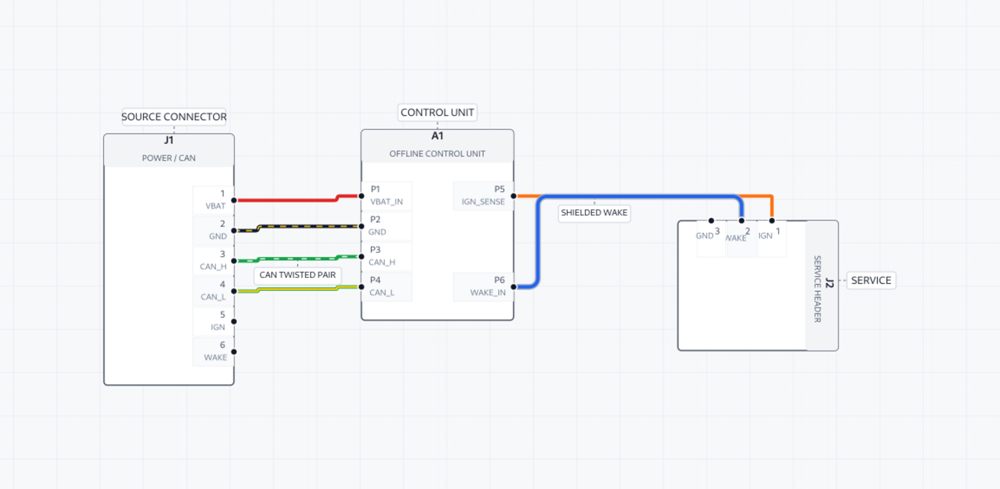

# RouteCore Offline Studio

RouteCore Offline Studio is a working offline-first wiring-harness visual editor built from the clean-room specification in `docs/`. It combines a framework-neutral TypeScript editor kernel with a local Node.js application server and a single-file SQLite `.routecore` project database.

## Implemented

- Dense CAD shell with Explorer, local Library, BOM, Properties, Style, Rules, Problems, Connectivity, History, and Output docks.
- Dynamic components with measured collision-safe four-sided pin banks, automatic body sizing, stable pin identities, rotation, mirroring, pin-matrix rebuilds, and connected-pin detach handling.
- Interactive component dragging, marquee selection, panning, focal zoom, snapping, port-to-port wire creation, route-segment manipulation, labels, undo/redo, context menus, and keyboard commands.
- Direct, orthogonal, dogleg, trunk, horizontal-first, vertical-first, and manual routing with lead-ins, obstacle clearance, deterministic rounded bends, route constraints, and diagnostics.
- Solid, stripe, tracer, dual, shield, and layered wire appearances with engineering colors preserved under selection and validation overlays.
- Background-aware label contrast keeps default annotations readable in both light and dark application themes while preserving explicit engineering colors.
- Local component and cable libraries, reusable Cable Creator and Component Creator, core-to-conductor assignment, BOM assignments, and manufacturing metadata.
- Plan Layout and Schematic views, generated Assembly models with stable origin mappings, immutable revisions, non-destructive command-history checkout, project checkpoints, integrity checks, and eight local exports.
- Loopback-only HTTP runtime, strict CSP, no telemetry, no accounts, no cloud API, no external fonts, and no runtime package dependencies.

## Run

Requirements: Node.js 22 or newer. The packaged release already includes compiled frontend and editor-core JavaScript; no `npm install` step is required.

Clone the authoritative editor engine with the repository:

```bash
git clone --recurse-submodules <routecore-repository-url>
# Existing checkout:
git submodule update --init --recursive
```

`references/editor-core` is the source of truth for reusable editor behavior. RouteCore compiles and vendors its pinned runtime during every build; `packages/harness-editor-core` is only a compatibility distribution. See `references/editor-core/docs/ROUTECORE_CAPABILITY_REVIEW.md` for the ownership boundary.

Portable launchers:

```text
Windows:        run.cmd
Linux / macOS: ./run.sh
```

The launchers keep application settings and the local reusable-part libraries in the extracted release folder under `data/`. See `START_HERE.md` for the shortest setup path.



```bash
node apps/studio/server/main.mjs --open
```

Use a specific project:

```bash
node apps/studio/server/main.mjs --open --project ./RouteCore-Demonstration.routecore
```

The server binds only to `127.0.0.1` or `::1`. By default, non-portable direct launches keep settings and libraries in `~/.routecore`; set `ROUTECORE_HOME` to choose another local directory. RouteCore writes new projects as `.routecore` files and can open legacy `.ohcad` project files without conversion.

## Build and test

TypeScript 5.8 or newer is needed only to rebuild from source.

```bash
npm run build
npm test
npm run check
```

Create the included reference project:

```bash
npm run demo:project
```

## Project layout

- `apps/studio/public` — offline browser UI and compiled frontend.
- `apps/studio/server` — loopback HTTP API, project service, SQLite persistence, and exporters.
- `packages/harness-editor-core` — RouteCore compatibility distribution and examples.
- `database` — baseline, editor, and application schemas.
- `docs` — clean-room editor, interaction, routing, and command specifications.
- `references/editor-core` — authoritative reusable editor engine, tests, docs, and performance runtimes.
- `tests` — application, database, API, export, security, and offline-runtime tests.
- `START_HERE.md`, `run.cmd`, `run.sh` — portable release launch path.
- `docs/VALIDATION_REPORT.md` — release qualification evidence and boundaries.

## Scope

This release is a substantial runnable implementation and reference architecture. It is not represented as a byte-for-byte clone of any commercial product. Production certification still requires organization-specific manufacturing rules, format qualification against target ERP/PLM systems, accessibility audits, and profiling on extremely large harnesses.
