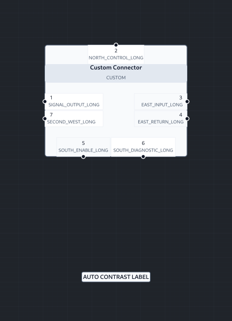

# RouteCore Offline Studio 0.4.0 — Editor Bug-Fix Report

Date: 2026-08-26

## Scope

This maintenance release addresses three defects reported from hands-on use of the 0.3.0 application:

1. pin labels and functions could overlap when pins were assigned to different component sides;
2. persisted command-history rows could not be checked out;
3. labels without an explicit text color inherited white text even though their default background was light.

## 1. Mixed-side component pin overlap

### Observed behavior

The Component Creator could place north, south, east, and west pins into geometric regions that competed with the header or with opposing-side text. Long pin functions made the problem more visible. North-side text could enter the title strip, and independently sized east/west text columns could collide.

### Root cause

The previous layout pass distributed each bank independently over its side and used fixed SVG text offsets. Component auto-sizing considered a rough pin-count estimate rather than the measured label/function extents of all four sides. Ports not represented by a bank were handled by a separate fallback pass, which also made side behavior inconsistent.

### Implemented correction

The component geometry builder now:

- normalizes declared and unbanked pins into one deterministic bank pipeline;
- measures every pin label and function before body sizing;
- reserves dedicated north and south text bands outside the header;
- allocates independent collision-safe text columns for west and east pins;
- includes bank gaps, row gaps, edge padding, label extents, and function extents in auto-size calculations;
- packs multiple banks along a side without reusing the same positions;
- collision-resolves explicit `sideFraction` preferences while preserving port order;
- emits exact `labelBounds`, `functionBounds`, label points, and function points in `PortGeometry`;
- renders pin text from those resolved bounds instead of fixed offsets;
- includes the text bounds in component world bounds, hit fitting, and viewport fitting.

The layout remains deterministic under rebuild, rotation, mirroring, serialization, and library instantiation.

## 2. Command-history checkout did not work

### Observed behavior

The History panel listed persisted commands, but the rows were informational only. There was no UI action or backend API to restore the recovery snapshot associated with a command.

### Root cause

The database already created rolling recovery snapshots after document commits, but `getCommandLog()` did not expose whether a command had a retained snapshot. Only named revision snapshots had a restore method and endpoint.

### Implemented correction

The history workflow now includes:

- a `restorable` flag and `snapshotId` on command-log records;
- an explicit **Checkout** action for every retained command state;
- a confirmation dialog explaining that checkout is non-destructive;
- a command-level restore API: `POST /api/project/commands/:sequence/restore`;
- server-side sequence validation and recovery-snapshot validation;
- current-state save before checkout;
- checkout as a new persisted command, so later history is not deleted;
- workspace/model/page/view restoration from the snapshot wrapper;
- an increased rolling recovery window of 500 command states per model;
- clear “Snapshot unavailable” feedback for entries outside the retention window.

Named immutable revisions continue to use their separate revision-restore workflow.

## 3. Default label text was white on a light label background

### Observed behavior

In dark application mode, a newly created label had a light default label background but displayed and reported white text in the Style inspector.

### Root cause

The renderer used `theme.text` as the default label foreground. In the dark editor theme, `theme.text` is intentionally light for the surrounding user interface, while `theme.labelBackground` is also light for printed engineering labels.

### Implemented correction

The label renderer and Style inspector now derive the default foreground from the actual label background:

- light backgrounds select `#111827`;
- dark backgrounds select `#f8fafc`;
- an explicit user-selected foreground remains authoritative;
- changing a background while the foreground is implicit updates the rendered contrast automatically;
- the engineering foreground is independent of selection, hover, and validation overlays.

## Regression coverage

Added automated coverage verifies:

- collision-free mixed-side pin label/function bounds;
- north-side text does not intersect the header;
- opposing-side text increases component width rather than overlapping;
- dark-theme labels render dark text on the default light background;
- command rows expose restorable snapshot metadata;
- database command checkout restores the selected document state;
- HTTP command checkout returns the restored workspace;
- the compiled frontend exposes the Checkout controls.
