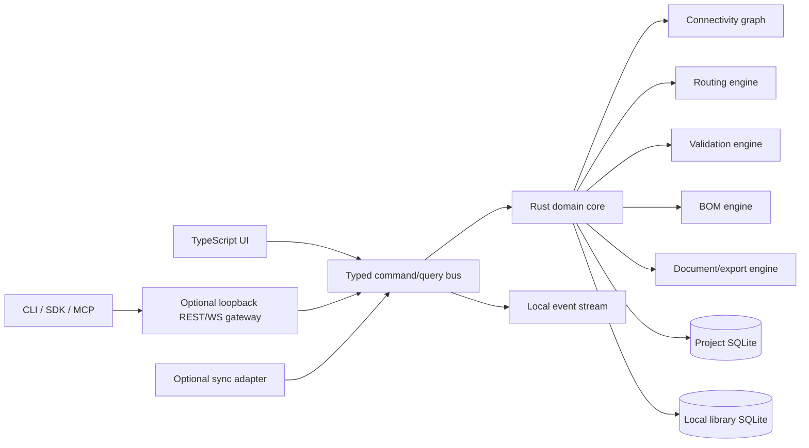
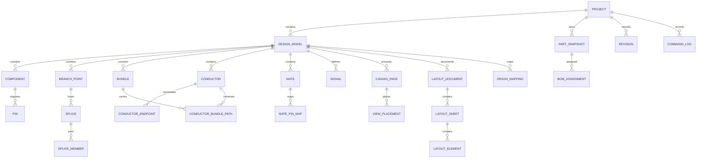

# RouteCore Clean-Room Product Specification

**Document ID:** RouteCore-CRS-001  
**Status:** Implementation-ready baseline  
**Revision:** 2.0  
**Research cut-off:** 2026-08-26  
**Product name:** RouteCore.  
**Primary objective:** Build a desktop-first cable and wiring-harness CAD system with workflow and capability parity to the publicly observable behavior of Splice CAD, while using an independently designed UI system, architecture, backend, data model, and source code. The complete core product shall work with networking disabled.

## Table of contents

<!-- TOC START -->
- [0. Executive decision](#0-executive-decision)
- [1. Clean-room boundary and evidence policy](#1-clean-room-boundary-and-evidence-policy)
- [2. Publicly observable product model to preserve](#2-publicly-observable-product-model-to-preserve)
- [3. Scope](#3-scope)
- [4. Users and primary jobs](#4-users-and-primary-jobs)
- [5. Information architecture](#5-information-architecture)
- [6. Desktop shell and visual system](#6-desktop-shell-and-visual-system)
- [7. Home and local workspace UX](#7-home-and-local-workspace-ux)
- [8. Project and Plan Builder UX](#8-project-and-plan-builder-ux)
- [9. Quick Assembly workflow](#9-quick-assembly-workflow)
- [10. Component Creator](#10-component-creator)
- [11. Cable Creator](#11-cable-creator)
- [12. Parts library and BOM UX](#12-parts-library-and-bom-ux)
- [13. Assembly generation and synchronization](#13-assembly-generation-and-synchronization)
- [14. Revisions, autosave, undo, and recovery](#14-revisions-autosave-undo-and-recovery)
- [15. Import and export requirements](#15-import-and-export-requirements)
- [16. Independent reference architecture](#16-independent-reference-architecture)
- [17. Offline-first guarantees](#17-offline-first-guarantees)
- [18. Domain model and invariants](#18-domain-model-and-invariants)
- [19. Persistence and project file design](#19-persistence-and-project-file-design)
- [20. Database model summary](#20-database-model-summary)
- [21. Core algorithms](#21-core-algorithms)
- [22. Design-rule checking](#22-design-rule-checking)
- [23. Local backend and integration API](#23-local-backend-and-integration-api)
- [24. Command protocol](#24-command-protocol)
- [25. SDK, CLI, MCP, and plugins](#25-sdk-cli-mcp-and-plugins)
- [26. Optional synchronization and collaboration](#26-optional-synchronization-and-collaboration)
- [27. Security and privacy](#27-security-and-privacy)
- [28. Performance and scale targets](#28-performance-and-scale-targets)
- [29. Accessibility, localization, and input](#29-accessibility-localization-and-input)
- [30. Logging, diagnostics, and supportability](#30-logging-diagnostics-and-supportability)
- [31. Testing strategy](#31-testing-strategy)
- [32. Delivery phases](#32-delivery-phases)
- [33. Release gates](#33-release-gates)
- [34. Functional requirement index](#34-functional-requirement-index)
- [35. UX acceptance summary](#35-ux-acceptance-summary)
- [36. Architecture decisions and rejected alternatives](#36-architecture-decisions-and-rejected-alternatives)
- [37. Source limitations and confidence](#37-source-limitations-and-confidence)
- [38. Handoff checklist for implementation](#38-handoff-checklist-for-implementation)
- [39. Visual editor kernel and interaction extension](#39-visual-editor-kernel-and-interaction-extension)
- [Appendix A. Suggested default shortcuts](#appendix-a-suggested-default-shortcuts)
- [Appendix B. Suggested designator defaults](#appendix-b-suggested-designator-defaults)
- [Appendix C. Terminology mapping](#appendix-c-terminology-mapping)
- [Appendix D. Deliverables in this package](#appendix-d-deliverables-in-this-package)
<!-- TOC END -->

---
## 0. Executive decision

RouteCore shall be a local-first engineering application, not a cloud application with an offline cache.

The source of truth for every project shall be a local SQLite project file. Project editing, parts search, validation, revision history, assembly generation, import, export, documentation generation, Python automation, and AI/MCP automation shall all remain available on an air-gapped computer. Online services shall be optional adapters that can be installed or enabled later. No account, subscription check, remote database, remote asset URL, telemetry call, update check, or online parts lookup may be required to open or edit a project.

The public evidence shows a product organized around two related workflows: a project-level topology or plan workflow, and a direct assembly workflow. It also documents a desktop application that runs offline and wraps the application with Tauri, but explicitly states that the desktop source is private. Therefore, this specification does not claim to reproduce Splice CAD's private implementation. It reproduces observable user outcomes through an independently selected stack and an independently authored domain model.

### 0.1 Proposed independent stack

| Layer | Selected design |
|---|---|
| Desktop shell | Tauri 2 class shell, Rust host, native filesystem dialogs, OS integration |
| UI | TypeScript, React, accessible component primitives, independent design tokens |
| Diagram engine | Hybrid SVG renderer with spatial indexing; optional WebGL acceleration for very large designs |
| Domain core | Rust crates for topology, connectivity, routing, BOM, DRC, revisioning, import, and export |
| Project storage | One portable SQLite file per project, WAL during editing, atomic checkpoint on close/save |
| Local application storage | Separate SQLite databases for settings, recent files, user library, and search indexes |
| Local automation backend | Embedded command/query service plus opt-in loopback REST and WebSocket gateway |
| Optional collaboration | Self-hostable sync hub; never needed for local use |
| Extensibility | Versioned command protocol, plugin SDK, Python SDK, CLI, and local MCP server |
| Export | SVG, PDF, PNG, CSV, XLSX, JSON, YAML, label formats, and manufacturing schedules |

### 0.2 Product principles

1. **Offline is the normal state.** Network access is an optional capability, not an assumed dependency.
2. **The topology model is authoritative.** Drawings are editable projections of engineering data, not disconnected pictures.
3. **Every user action is a command.** Commands are transactional, undoable, scriptable, replayable, and testable.
4. **Manufacturing output is first class.** BOM, cut list, termination schedule, continuity table, and drawing packages are generated from the same model.
5. **Open, durable project data.** A user can inspect, migrate, back up, and export all project information without a vendor service.
6. **Deterministic behavior.** Identical input, command sequence, fonts, and export profile produce identical structured output.
7. **Dense but legible engineering UI.** The application favors efficient keyboard and pointer workflows, clear state, and high information density.
8. **Clean-room independence.** Public behavior may guide requirements; proprietary code, assets, text, catalog data, and hidden implementation details shall not be copied.

---

## 1. Clean-room boundary and evidence policy

### 1.1 Allowed inputs

The requirements team may use only these input classes:

- Public product pages, public documentation, public tutorials, public blog posts, and public screenshots.
- Publicly documented schemas and API contracts.
- Public repositories whose licenses permit inspection and the intended reuse.
- Normal black-box operation of a lawfully accessed product for documenting externally visible behavior.
- General cable-harness engineering knowledge, public standards, and independently created test fixtures.

### 1.2 Prohibited inputs

The implementation team shall not use:

- Decompiled, disassembled, instrumented, or extracted proprietary desktop binaries.
- Minified application bundles as a substitute for public documentation.
- Private source code, leaked material, credentials, internal database dumps, or non-public API traffic.
- Splice branding, logo, screenshots, illustration assets, proprietary icon files, marketing prose, or exact visual assets.
- A copied or scraped proprietary component/parts catalog.
- Pixel-for-pixel tracing of unique visual compositions.

### 1.3 Evidence classes

Every parity requirement in this document is assigned one of three evidence classes.

| Class | Meaning | Implementation consequence |
|---|---|---|
| O - Observed | Visible in public UI, screenshots, documentation, or tutorials | May be implemented as a functional requirement with independent code and visuals |
| P - Public interface | Published schema, open-source SDK, API description, or public integration contract | May inform interoperability; license terms must be recorded |
| I - Independent proposal | Architecture, database, algorithm, security model, or UX improvement designed for RouteCore | Normative for RouteCore, but not claimed to describe Splice CAD |

### 1.4 Team separation protocol

For a high-assurance clean-room process, use two roles:

- **Behavior team:** records requirements, workflows, screenshots as references, data examples, and acceptance tests. It must not deliver proprietary assets or hidden implementation clues.
- **Implementation team:** receives only this specification, the evidence matrix, public standards, and approved public interface definitions. It writes all production code independently.

Every requirement or test derived from a competitor behavior shall have a source entry in `EVIDENCE_MATRIX.md`. Every implementation pull request shall include a declaration that no prohibited source was used.

### 1.5 Visual differentiation rules

RouteCore may use the standard professional CAD arrangement of project tree, drawing canvas, properties inspector, tool rail, and status bar. It shall nevertheless differ materially in:

- Product name, logo, typography, color system, shadows, radii, icon family, splash screen, and empty states.
- Exact toolbar composition, spacing, button shapes, panel header treatment, selection color, and animation.
- Copywriting, labels where alternate engineering terminology is reasonable, onboarding, and help content.
- Component symbol rendering details and drawing template styling.

The target is workflow parity and comparable efficiency, not brand confusion.

---

## 2. Publicly observable product model to preserve

The public references describe four main authoring surfaces:

1. **Project or Plan Builder:** top-down system and harness topology, pages, bundles, branch points, components, conductors, signals/nets, parts, and assembly generation.
2. **Assembly Builder:** direct construction of one cable or harness assembly, with a schematic source view and manufacturing/layout documentation.
3. **Component Creator:** creation of reusable connector, terminal, termination, and generic component definitions with pins and graphics.
4. **Cable Creator:** creation of multi-core cable definitions with core properties, shield/drain behavior, and reusable part information.

The project workflow has an authoritative Plan and one or more generated Assemblies. The Plan exposes separate Layout and Schematic projections. Components, bundles, conductors, branch points, splices, mates, device groups, wire groups, cables, signals, notes, pages, parts, and BOM assignments are visible concepts. Assemblies can be generated from a selection of Plan entities and later synchronized by reviewing a diff.

RouteCore shall preserve these user outcomes while implementing its own data structures and interaction details.

---

## 3. Scope

### 3.1 In scope for version 1.0

- Windows, Linux, and macOS desktop application.
- No-account local workspace and recent-project dashboard.
- Project/Plan workflow and Quick Assembly workflow.
- Layout and Schematic design views.
- Components, pins, mates, internal bridges, terminal points, terminations, branch points, splices, bundles, conductors, flying leads, pigtails, jumpers, device groups, visual groups, notes, wire groups, cables, signals, and derived nets.
- Component and cable definition editors.
- Local parts library with import, search, compatibility rules, and project snapshots.
- Plan-level and assembly-level BOM.
- Assembly generation, mapping, synchronization, and conflict review.
- Drawing/document layout editor with multiple sheets and reusable templates.
- Manufacturing exports and interchange formats.
- Autosave, undo/redo, explicit revisions, compare, restore, and crash recovery.
- Local REST/WebSocket integration gateway, CLI, TypeScript SDK, Python SDK, and MCP server.
- Plugin host with capability permissions.
- Optional self-hosted synchronization service, disabled by default.
- Accessibility, high-DPI support, keyboard operation, and color-blind-safe signaling.

### 3.2 Deferred but architecturally supported

- Native mobile editing.
- Full mechanical 3D harness routing.
- Automated nail-board CNC output.
- Enterprise PLM/ERP connectors beyond the plugin API.
- Hosted multi-tenant SaaS.
- Supplier price and availability aggregation.
- Electrical simulation beyond continuity, current, voltage-drop, and rule checks.

### 3.3 Explicit non-goals

- Reusing the Splice name, identity, copyrighted assets, private code, or private catalog.
- Guaranteeing binary or undocumented API compatibility.
- Depending on a vendor cloud to validate a license or access projects.
- Treating exported drawings as the primary engineering database.
- Hiding project data in an opaque proprietary cloud format.

---

## 4. Users and primary jobs

### 4.1 Harness design engineer

Creates system topology, defines connectors and routes, assigns signals and parts, checks design rules, generates assemblies, and produces review packages.

### 4.2 Manufacturing engineer

Consumes cut lists, termination schedules, covering schedules, splice schedules, continuity tables, and formboard-style drawings. Adds manufacturing notes and checks tolerances.

### 4.3 Electrical system architect

Works at Plan level, creates device groups, defines interface boundaries and signals, and delegates assemblies without losing system connectivity.

### 4.4 Technician or small workshop

Builds a single cable quickly in Quick Assembly mode, prints labels, exports a PDF, and works without IT infrastructure or internet access.

### 4.5 Librarian or component engineer

Maintains local component, connector, contact, wire, cable, accessory, covering, and manufacturer data. Defines compatibility and controlled templates.

### 4.6 Automation developer

Uses CLI, Python, REST, WebSocket, or MCP to import spreadsheets, create or review designs, run validation, generate documents, and integrate version control.

---

## 5. Information architecture

### 5.1 Application-level navigation

The desktop application shall expose these top-level destinations:

- **Home:** recent projects, pinned projects, templates, recovery items, import, and new project.
- **Projects:** local file browser and indexed project metadata.
- **Parts Library:** user and installed catalog packs, search, editor, import, and validation.
- **Templates:** project, component, cable, drawing, export, and label templates.
- **Automation:** local gateway, CLI setup, SDK examples, MCP status, and plugin management.
- **Settings:** units, appearance, storage, backups, keyboard, privacy, updates, and optional sync.

No top-level destination shall require authentication. Optional remote workspaces appear only after a user enables and configures a sync provider.

### 5.2 Project tree

A project tree shall present:

- Project metadata and documents.
- Plan.
  - Pages.
  - Components and device groups.
  - Branch points and splices.
  - Bundles and conductors.
  - Signals and nets.
  - Notes and visual groups.
- Assemblies.
  - Assembly model.
  - Documentation sheets.
  - Manufacturing outputs.
- Project parts and BOM.
- Revisions and comparisons.
- Attachments.
- Validation results.

Tree nodes support rename, reveal, focus on canvas, selection, multi-selection, drag reorder where meaningful, context actions, and status badges.

### 5.3 Canonical hierarchy

```text
Workspace
  Project file (.routecore)
    Project metadata
    Plan model (exactly one)
      Engineering entities
      Plan pages and view placements
    Assembly model (zero or more)
      Generated or independent entities
      Documentation sheets
    Project part snapshots and BOM assignments
    Attachments
    Revisions and command history
```

A Quick Assembly file is still represented internally as a Project with an Assembly model and no populated Plan. This avoids maintaining two incompatible backends.

---

## 6. Desktop shell and visual system

### 6.1 Window layout

The default editor window uses five persistent regions:

```text
+-----------------------------------------------------------------------+
| Menu / document tabs / save state / undo / export / command palette   |
+------------------+------------------------------------+---------------+
| Project explorer |                                    | Mode rail     |
| and local search |         Infinite engineering       | + inspector   |
|                  |              canvas                |               |
|                  |                                    |               |
+------------------+------------------------------------+---------------+
| Context toolbar / view switch / page navigation / status / coordinates|
+-----------------------------------------------------------------------+
```

Recommended default dimensions at 1440 x 900:

- Top application bar: 40 px.
- Project explorer: 260 px, resizable from 200 to 520 px.
- Right inspector: 340 px, resizable from 280 to 600 px.
- Mode rail: 44 px.
- Bottom context and status region: 48 px combined.
- Panel gutters: 1 px separators with 4 px hit targets.

The shell must remain usable at 1280 x 720. At narrower widths, side panels become overlay drawers. Layout state is saved per project and per workspace.

### 6.2 Density

Three density profiles shall be available:

- **Compact:** 28 px controls, 12 px base text, optimized for large desktop monitors.
- **Standard:** 32 px controls, 13 px base text.
- **Accessible:** 40 px controls, 15 px base text and larger hit targets.

The default is Standard. Tables may independently use compact rows.

### 6.3 Independent visual identity

Use an original token system. Example baseline, subject to brand design:

- Neutral graphite surfaces with a distinct cool or warm accent selected by the user.
- 4 px corner radius for controls, 2 px for engineering badges, 6 px for dialogs.
- One open-source icon family, with custom engineering icons drawn from scratch.
- Monospace numerals for dimensions, designators, coordinates, and part numbers.
- Selection state shall combine outline, subtle fill, and shape handles so color is not the only signal.

Do not reproduce Splice logos, exact colors, screenshots, or icon assets.

### 6.4 Global commands

- New, Open, Close, Save Checkpoint, Save As, Package Copy.
- Undo, Redo, Command History.
- Find Anything.
- Validate.
- Import, Export, Print.
- Toggle panels, focus canvas, focus tree, focus inspector.
- Zoom, fit selection, fit page, fit design.
- Command palette.
- Help for current tool and shortcut overlay.

### 6.5 Save-state language

The top bar shall always expose one of these states:

- `Saved locally`
- `Saving...`
- `Recovered draft`
- `Read only`
- `External file changed`
- `Sync pending` only when optional sync is configured
- `Conflict` only when optional sync is configured

A local save shall never be described as a cloud save.

---

## 7. Home and local workspace UX

### 7.1 First launch

First launch shall succeed with all network interfaces disabled. The application shall:

1. Create local settings and library databases.
2. Ask for default units and document size, with sensible regional defaults.
3. Offer an optional local starter parts pack bundled with the installer.
4. Explain local file storage and backups.
5. Open the Home screen without login, email, or license activation.

Network-dependent options appear in a secondary `Optional online features` section and default to off.

### 7.2 Home screen

The Home screen contains:

- New Project.
- New Quick Assembly.
- Open File.
- Import spreadsheet or interchange file.
- Recent projects with path, modified time, preview, branch/revision state, and missing-file status.
- Pinned templates.
- Recovery candidates after a crash.
- Local storage and backup health.

The recent list is metadata only. Deleting a recent entry never deletes the project without an explicit destructive confirmation.

### 7.3 Project creation wizard

Steps:

1. Name and local file location.
2. Workflow: Project/Plan or Quick Assembly.
3. Units: millimetres/inches; AWG/mm2 display; internal storage remains canonical SI integers.
4. Drawing defaults: page size, orientation, title block template.
5. Designator profile: IEC-like, user-defined prefixes, or imported profile.
6. Starter template and local library packs.
7. Create.

The wizard writes the project database immediately and enters the editor. There is no remote provisioning step.


---

## 8. Project and Plan Builder UX

### 8.1 Plan as the engineering source of truth

A Project contains exactly one Plan. The Plan describes system-level electrical and physical topology. It is not a flattened drawing. The Plan stores component instances, pins, logical connections, routed conductors, physical bundles, branch points, splices, mating relationships, signal definitions, parts, and view placements.

The Plan shall offer two synchronized projections:

- **Layout view:** compact physical topology focused on components, bundles, lengths, branch points, coverings, cables, and harness shape.
- **Schematic view:** expanded pin-level connectivity focused on conductors, pin tables, splices, mates, signal tracing, and logical readability.

A change to the engineering model is visible in both projections. View-only placement changes remain local to the selected projection.

### 8.2 Plan toolbar

The primary Plan toolbar shall include independent icons and labels for:

- Select.
- Place component.
- Place branch point.
- Draw bundle.
- Draw conductor or connection.
- Place splice.
- Create mate.
- Place note.
- Create visual group.
- Measure.
- Validate.

Tool buttons display a tooltip, shortcut, and one-line interaction hint. The active tool is visually persistent until the operation completes or Escape returns to Select. Double-clicking a placement tool pins it for repeated use.

### 8.3 Interaction modes

#### Select mode

- Click selects one entity.
- Shift-click adds or removes an entity from selection.
- Drag on empty space box-selects.
- Left-to-right box selects fully enclosed objects; right-to-left box may optionally select crossing objects.
- Alt-click cycles overlapping hit targets.
- Escape clears selection, then exits nested editing on a second press.
- Enter opens the primary editor for the selection.

#### Pan and zoom

- Middle-button drag or Space+drag pans.
- Wheel zooms around pointer; a preference may assign wheel to vertical scroll.
- Trackpad pinch zooms.
- Home fits design; Shift+Home fits current page; F fits selection.
- The status bar shows zoom, pointer coordinates, snap state, current page, and validation count.

#### Direct manipulation

- Drag component or branch point to move.
- Drag route segment or waypoint to reshape.
- Drag a connection endpoint to reconnect, with a preview of consequences.
- Ctrl or Cmd constrains to grid; Shift constrains axis; Alt temporarily disables snapping. These modifiers are configurable.
- Every drag is preview-only until pointer release; one undo step records the entire gesture.

### 8.4 Pages

Plan pages partition a large project without partitioning connectivity.

Requirements:

- Create, duplicate, rename, reorder, archive, and delete pages.
- Assign any component, branch point, note, or visual group to one page.
- Permit cross-page electrical connectivity.
- Show off-page references for conductors or bundles whose endpoints are not visible together.
- Retain independent pan, zoom, and visible-layer state per page.
- Export one page or all pages.
- Show page assignment in the tree and Bulk Editor.

Deleting a page requires choosing whether its entities move to another page or are deleted. Default action is move to an automatically created `Unassigned` page.

### 8.5 Components

A component instance shall support these categories:

- Connector.
- Terminal point.
- Termination.
- Generic electrical device.
- Inline device.
- Passive or protection device.
- User-defined category.

Common properties:

- Stable UUID and human designator.
- Name, description, category, tags, manufacturer, MPN, revision, and lifecycle state.
- Symbol reference and instance-level display overrides.
- Physical orientation, schematic orientation, and view placements.
- Position count, pin labels, pin functions, pin details, pin electrical class, and pin gender where applicable.
- Mating definition and allowed mates.
- Internal bridges.
- Required or optional accessories.
- Assigned part snapshot and project BOM references.
- Custom typed properties.

Designators are generated from a configurable profile and remain stable after creation unless the user explicitly renumbers.

### 8.6 Pins and positions

Each pin has:

- Internal index.
- Display label such as `1`, `A2`, `GND`, or `TX+`.
- Optional function and detail.
- Electrical class, current limit, voltage range, contact size, supported wire range, and sealing requirement.
- Optional contact and seal part assignment.
- Connection side and termination method.
- Connected endpoint count and rule limits.

Pin labels need not be sequential. A component definition may map internal indices to arbitrary labels. Internal bridge groups shall join two or more pins electrically without requiring a visible external wire.

The UI shall render pins as a virtualized table for large connectors. Filters include connected, unconnected, function, signal, warning, and text search. A `Collapse empty pins` view option hides unused positions without deleting them.

### 8.7 Mates and device groups

A mate connects compatible component faces and may define a pin-to-pin map. Mates participate in derived net connectivity.

- Create a mate by selecting two components or dragging a mate handle.
- Verify category, position count, gender, keying, and explicit compatibility rules.
- Permit custom pin mapping when numbering differs.
- Display mate relationship in both views and in interface exports.
- Allow one side to represent an external or off-project interface.

A device group visually and semantically groups multiple connectors belonging to one device. It supplies a group name, device reference, metadata, and optional common part/subassembly. Connection tables group connectors under the device group.

### 8.8 Branch points

A branch point is a physical routing node. It may:

- Join two or more bundles.
- Host zero or more splices.
- Carry a designator, label, part, boot, transition, or accessory.
- Define branch angle preferences and manufacturing position.
- Appear compactly in Layout and as a routing junction in Schematic.

Branch points are not automatically electrical connections. Conductors passing through a branch point remain independent unless a splice or explicit junction connects them.

### 8.9 Bundles

A bundle is a physical path segment between two routing nodes. Routing nodes may be components, branch points, or approved free routing nodes.

Bundle properties:

- Stable ID and optional display name.
- Start and end routing nodes.
- Nominal length and asymmetric or symmetric tolerance.
- Measurement method and datum.
- Diameter estimate and fill ratio.
- Color and display style.
- Coverings, sleeves, tape, conduit, heat shrink, boots, ties, clips, and labels.
- Assigned cable where the segment is a multi-core cable.
- Conductors traversing the bundle.
- Waypoints and bend handles for each view.

Supported operations:

- Insert branch point.
- Redirect endpoint.
- Split, join, merge, and reverse.
- Consolidate parallel or hub-and-spoke segments where topology permits.
- Move a waypoint, add waypoint, remove waypoint, straighten, distribute bends, and auto-route.
- Reassign traversing conductors with a diff preview.
- Delete with a choice to delete, reroute, or preserve affected conductors as unrouted.

The application must never silently delete conductor connectivity when a bundle edit invalidates a route.

### 8.10 Conductors

A conductor is an electrical path between two or more endpoints and may traverse an ordered bundle path. It may represent:

- Discrete wire.
- Cable core.
- Shield or drain.
- Pigtail lead.
- Flying lead.
- Jumper member.

Properties:

- Name and optional wire ID.
- Endpoints and connection/termination methods.
- Ordered route through bundles.
- Gauge or cross-section, insulation color, stripe color, material, stranding, temperature rating, voltage rating, and wire part.
- Signal association through a derived net.
- Source designation such as cut from stock or included with component.
- Length rule: calculated from route, explicit override, service-loop allowance, strip allowance, and tolerance.
- Label definitions and print data.

The editor shall show route validity, total calculated length, per-segment length, and any override. Cable core properties inherit from the cable definition unless explicitly modeled as a permitted manufacturing override.

### 8.11 Connection creation

Connection creation shall support:

- Pin-to-pin.
- Pin-to-branch path.
- Pin-to-splice.
- Pin-to-flying lead.
- Terminal point and termination variants.
- Multi-endpoint conductors where allowed.
- Bulk connect patterns: one-to-one, reversed, interleaved, shifted, and table-mapped.

During creation, the application highlights valid targets and explains invalid targets. A preview displays the future route, generated conductor name, inherited signal defaults, and proposed pin assignments. The operation is committed as one command.

### 8.12 Splices

A splice is an explicit electrical join among conductor endpoints. It shall have:

- Designator.
- Type such as butt, parallel, Y, ultrasonic, solder sleeve, or user-defined.
- Host branch point or free physical location.
- Member conductor endpoints.
- Part assignment, compatible gauge range, combined cross-section rule, and environmental rating.
- Manufacturing notes and strip/crimp settings.

The DRC engine checks splice member count, gauge compatibility, total cross-section, part compatibility, and physical placement.

### 8.13 Flying leads, pigtails, and jumpers

A flying lead terminates without a modeled mating component and records termination type, exposed length, treatment, and label.

A pigtail lead is a short wire segment associated with a component or termination. It has its own gauge, color, length, wire part, and endpoint treatment.

A jumper explicitly bridges component positions and may have a part, designator, and BOM entry. It is distinct from an internal logical bridge because it is physically manufactured and documented.

### 8.14 Wire groups and cables

Conductors may be grouped as:

- Twisted pair or multi-wire twist, with pitch and direction.
- Bundled group.
- Shielded group.
- Multi-core cable.

A cable definition contains ordered cores, each with label, color, stripe, gauge/cross-section, optional wire part, pair/group membership, shield, drain, and impedance metadata. Assigning a cable to a bundle maps cores to conductors and creates one cable BOM item rather than independent stock-wire items. The UI shall show missing cores, duplicate mappings, extra conductors, and property mismatches.

### 8.15 Signals and derived nets

A signal classifies an electrical path and may define defaults for conductor color, stripe, gauge, voltage, class, and documentation color.

A net is computed, not manually built. Conductors are in the same net when connected through conductor continuity, explicit splices, mated pin mappings, internal pin bridges, jumpers, and transitive combinations.

Rules:

- A net may have zero or one assigned signal.
- Signal defaults do not overwrite conductor values automatically.
- Assigning or reapplying defaults fills only empty values unless the user chooses `force replace`.
- Intentional conductor overrides remain visible with an out-of-sync indicator.
- Each net can have a user display-name override.
- Selecting a net highlights all member conductors and connected pins across pages.
- Renaming a signal does not silently rename a user-overridden net name.

### 8.16 Notes and visual groups

Notes support text, numbered list, table, requirement, warning, and manufacturing instruction classes. Notes can be anchored to entities or placed freely. They export as native vector text.

Visual groups create labeled, resizable regions for subsystem organization. They do not modify electrical connectivity. Their z-order is behind engineering entities by default.

### 8.17 Right inspector

The right panel uses tabs:

- **Properties:** selected entity or multi-edit intersection.
- **Bulk Editor:** spreadsheet-like entity tables.
- **Nets:** derived nets, signal assignment, names, and highlight.
- **Parts:** project BOM, local search, assignments, and templates.
- **Pages:** pages, visibility, export inclusion, and entity assignment.
- **DRC:** errors, warnings, waivers, and fix actions.

Tabs may be detached into separate windows for multi-monitor work. Panel contents use stable row heights and virtualized tables.

### 8.18 Bulk Editor

The Bulk Editor provides tabs for components, pins, bundles, conductors, connections, signals, branch points, splices, mates, cables, and parts.

Required behavior:

- Sort, filter, group, freeze columns, resize columns, and save views.
- Copy/paste rectangular ranges to and from spreadsheet applications.
- Paste preview with type conversion and validation.
- Multi-cell fill, series fill, and find/replace.
- Per-cell warnings and formula-like derived read-only columns.
- One paste or fill operation is one undoable transaction.
- Export the current filtered view to CSV or XLSX.

### 8.19 Context menu

Context menus are selection-aware and grouped by purpose:

- Edit and inspect.
- Connect and route.
- Assign signal, part, cable, group, page, or assembly.
- Align, distribute, rotate, mirror, and arrange.
- Convert or insert.
- Validate selection.
- Export selection.
- Delete with impact preview.

Commands appear in the command palette under the same names. Context menus must not be the only way to reach a command.

---

## 9. Quick Assembly workflow

### 9.1 Purpose

Quick Assembly mode serves users designing one standalone cable or harness without first building a system Plan. It uses the same entity types, renderer, parts engine, and export engine as the Project workflow.

### 9.2 Source and documentation views

Each Quick Assembly has:

- **Schematic source view:** components, pins, wires, cables, connection labels, wire anchors, and electrical data.
- **Layout documentation view:** physical assembly depiction, editable bundle curves, dimensions, BOM tables, schedules, title blocks, notes, legends, and page frames.

The Schematic model is authoritative. Documentation elements reference live model queries rather than containing copied tables.

### 9.3 Assembly editor shell

The left panel shows assembly summary, design tree, BOM, and pages. The center shows the active view. The right tool area exposes Component, Wire, Cable, Part, and PDF/Document configuration. A contextual bottom bar exposes operations relevant to the current selection.

RouteCore shall use its own grouping and iconography while preserving comparable reachability of actions.

### 9.4 Components and connections

Quick Assembly supports connector, terminal point, termination, generic component, and cable blocks. Users may place library items or create lightweight generic items inline.

Connections support single creation and Bulk Connect. Wire anchors permit readable jogs without changing endpoints. Labels may show wire ID, signal, gauge, color, length, or a user-defined template.

### 9.5 Layout documentation

The Layout editor shall support:

- Letter, A4, A3, A2, A1, and custom sheet sizes.
- Portrait and landscape.
- Drawing borders and zone references.
- Reusable title blocks and document templates.
- Independent text scale per sheet.
- Blank, assembly, cable specification, connector specification, and requirements templates.
- Assembly view, BOM table, wire schedule, cut list, connection table, termination schedule, splice schedule, notes, title block, legend, revision table, approval block, images, and arbitrary vector graphics.
- Live filtering by assembly, page, component set, signal, or manufacturing stage.
- Component repositioning and bundle Bezier editing for documentation without changing logical connectivity.
- Dimension annotations tied to model values.

### 9.6 PDF options

PDF export configuration includes:

- Included sheets and order.
- Paper size and scaling.
- Vector fonts or embedded fonts.
- Color, grayscale, or monochrome.
- Line-weight profile.
- Watermark and revision status.
- Page header/footer.
- Attachment of structured JSON or CSV as PDF attachments where supported.
- Optional signature block.

---

## 10. Component Creator

### 10.1 Layout

The Component Creator uses:

- Left properties and metadata panel.
- Center symbol/graphic canvas.
- Right layers, pins, elements, and validation panel.
- Top tabs for symbol, mate face, wire/termination representation, and preview.
- Bottom drawing tools.

This composition is a conventional editor pattern; RouteCore styling and exact arrangement shall be original.

### 10.2 Definition model

A reusable component definition includes:

- Identity: manufacturer, MPN, internal part number, revision, description, category, tags, lifecycle.
- Pin count and pin records.
- Connector face metadata: gender, keying, series, shell size, sealing, orientation.
- Mating compatibility and pin-map presets.
- Electrical/mechanical custom properties.
- Symbol graphics for schematic, layout, and documentation.
- Connection anchor positions.
- Default designator prefix.
- Required and optional contacts, seals, backshells, wedge locks, cavity plugs, strain relief, hardware, and other accessories.
- Images and datasheet attachments, stored locally or referenced through a user-controlled attachment policy.

### 10.3 Graphic editor

Supported vector elements:

- Rectangle, rounded rectangle, ellipse, line, polyline, polygon, path, text, image, pin marker, connection anchor, and dimension marker.
- Layers with visibility, lock, z-order, and semantic role.
- Grid, rulers, guides, align, distribute, mirror, rotate, group, and boolean path operations.
- SVG import with sanitization and conversion to the internal safe subset.
- SVG export without application chrome.

All imported SVG scripts, external resource loads, filters outside the safe subset, and event handlers are stripped.

### 10.4 Pin table

Pin rows support bulk generation, sequential labels, alphanumeric patterns, paste from spreadsheet, functions, details, electrical class, contact assignment, group, and anchor binding. Validation detects duplicate labels, missing anchors, invalid bridge groups, and disconnected visible pin graphics.

### 10.5 Preview and publish

Preview shows the definition in Layout, Schematic, mate, and documentation contexts. Publishing saves a new local library revision. Existing project instances retain their part snapshot until the user explicitly updates them and reviews a diff.

---

## 11. Cable Creator

A cable definition includes:

- Manufacturer, MPN, internal number, revision, description, category, and lifecycle.
- Outer diameter, jacket material/color, minimum bend radius, mass per length, temperature and voltage ratings.
- Ordered cores with labels, colors, stripes, gauge/cross-section, conductor material, stranding, insulation, and optional core part number.
- Pair/group assignments and twist pitch.
- Overall shield, pair shields, foil/braid metadata, drain wires, and shield termination defaults.
- Impedance and capacitance properties where relevant.
- Default cut and strip allowances.
- Cross-section graphic and cable symbol.

The editor offers table entry, spreadsheet paste, core duplication, pattern generation, pair creation, shield creation, validation, preview, and local library publishing.

---

## 12. Parts library and BOM UX

### 12.1 Offline library layers

The library system shall combine four layers without requiring internet access:

1. Read-only starter pack installed with the application.
2. User library database.
3. Optional installed catalog packs with recorded license and source metadata.
4. Project-local part snapshots.

Search order favors project parts, then user library, then installed packs. Remote lookup appears only as an optional provider and never blocks local work.

### 12.2 Search

Local search shall support:

- Fuzzy token search across manufacturer, MPN, internal number, description, family, category, and tags.
- Exact MPN mode.
- Facets for type, manufacturer, positions, gender, series, gauge range, cable core count, lifecycle, and source pack.
- Compatibility filtering based on selected component, pin, wire gauge, cable, accessory, or mate.
- Saved searches and recent selections.
- Search-as-you-type under 100 ms for a 500,000-part local index on reference hardware.

SQLite FTS5 is the baseline index. Optional semantic search may be provided through a local embedding plugin, but exact and faceted search remains fully functional without it.

### 12.3 Part snapshots

Assigning a library part to a project copies a normalized snapshot into the project database. The snapshot stores source identity, source revision, essential specifications, attribution, and a content hash. Later library updates never silently change a released project.

An `Update from library` command shows a field-level diff and affected design-rule results before commit.

### 12.4 BOM assignment

Parts may be assigned to:

- Components.
- Contacts and seals by pin or pin group.
- Wires and cable cores.
- Cables.
- Splices.
- Bundle coverings and accessories.
- Branch points.
- Jumpers.
- Device groups and subassemblies.
- Documentation-only or miscellaneous project items.

The BOM panel shall show grouped quantities, used-by designators, source, lifecycle, missing data, and assignment completeness.

### 12.5 BOM consolidation

Consolidation key priority:

1. Same project part-snapshot ID.
2. Same normalized manufacturer plus normalized MPN plus part kind.
3. User-defined consolidation key.

Wire stock is additionally separated by gauge/cross-section, insulation color, stripe, and material. Cable is consolidated by cable part snapshot. Quantities use exact rational or integer units as appropriate; lengths use canonical integer micrometres and are rounded only for output.

### 12.6 Accessories and contacts

The library supports compatibility graphs for contacts, seals, cavity plugs, backshells, wedge locks, strain reliefs, dust caps, coupling rings, mounting hardware, heat shrink, sleeves, tape, boots, ties, clips, grommets, and user-defined accessory classes.

Contact selection filters by connector cavity, contact size, wire range, material, plating, gender, and termination method. Bulk assignment can apply a compatible contact to all matching pins while preserving explicit overrides.

### 12.7 Local catalog pack format

An installable `.ohlib` pack is a ZIP container with:

- `manifest.json`: pack ID, publisher, version, license, source URL, creation date, schema version, and signature metadata.
- `catalog.sqlite`: normalized parts and FTS indexes.
- `assets/`: images, symbols, and datasheets permitted by the pack license.
- `LICENSES/`: license and attribution files.
- `signature.json`: optional Ed25519 signature.

Unsigned packs may be installed after a warning. The application never treats a signature as proof that part data is technically correct.

---

## 13. Assembly generation and synchronization

### 13.1 Generation

The user selects Plan entities or one or more topology regions and invokes `Generate Assembly`.

The wizard shall:

1. Name the assembly and choose a designator/profile.
2. Show included components, bundles, conductors, splices, groups, cables, parts, and notes.
3. Show boundary interfaces and off-assembly connections.
4. Choose BOM mode: linked project BOM view or independent assembly BOM snapshot.
5. Choose documentation template.
6. Validate the selection.
7. Generate one assembly model and a mapping from every generated entity to its Plan origin.

Typical mappings:

- Plan component to assembly connector/device.
- Plan bundle to assembly segment.
- Plan conductor to assembly wire/core.
- Plan branch splice to assembly junction.
- Plan cable and wire group to assembly grouping.
- Plan note to assembly note when included.

### 13.2 Mapping identity

Every generated entity stores:

- `origin_project_id`
- `origin_model_id`
- `origin_entity_id`
- `origin_revision_id`
- `generation_rule_version`
- `last_synced_content_hash`

Human designators are not used as identity.

### 13.3 Sync review

When the Plan changes, the Assembly shows `Plan changes available`. Opening Sync produces a structured diff:

- Added, removed, and modified entities.
- Connectivity changes.
- Part/BOM changes.
- Length/tolerance changes.
- Signal and label changes.
- Local assembly overrides that conflict with incoming changes.

For each conflict, the user chooses Plan, Assembly, merge, keep both, or defer. Non-conflicting changes may be accepted in bulk. Applying the sync is one transaction and one undo step. The sync record is stored in revision history.

### 13.4 Override policy

Fields are classified as:

- **Plan-owned:** topology, origin endpoints, Plan designator, signal association.
- **Assembly-owned:** documentation placement, sheet membership, manufacturing-only notes, layout curve refinement.
- **Mergeable:** labels, lengths, tolerances, parts, and termination details according to project policy.

Project templates may change ownership rules, but a field cannot silently switch ownership after an assembly is generated.

---

## 14. Revisions, autosave, undo, and recovery

### 14.1 Command model

Every mutation is represented by a versioned command envelope. Commands are validated against the current base revision, executed transactionally, and appended to the project command log with their inverse or restoration data.

Examples:

- `component.create`
- `component.update`
- `connection.create`
- `bundle.split`
- `conductor.reroute`
- `signal.assign_to_net`
- `bom.assign_part`
- `assembly.generate`
- `assembly.sync.apply`
- `layout.element.move`
- `bulk.apply_patch`

### 14.2 Autosave

- A completed command is committed to SQLite immediately.
- UI draft fields may debounce for at most 500 ms, but focus loss and window close force commit or cancel.
- WAL is checkpointed periodically and on clean close.
- A recovery snapshot is written after significant operations and at a configurable interval.
- No separate Save action is required for data durability.

The visible `Save Checkpoint` action creates a named revision and optionally copies the file to its configured backup destination.

### 14.3 Undo and redo

- Undo operates on command batches, not low-level property writes.
- Drag gestures, imports, bulk edits, generation, and sync apply each form one batch unless the user chooses otherwise.
- Undo survives application restart for the configurable recent command horizon.
- New edits after undo create a branch in history rather than deleting unreachable commands immediately.
- The history viewer may restore, compare, name, or prune branches.

### 14.4 Explicit revisions

A revision records author identity, timestamp, message, parent revision, command range, validation summary, model hash, optional signature, and release state such as Draft, Review, Released, or Obsolete.

Released revisions are immutable. Editing after release creates a new draft branch.

### 14.5 Crash recovery

On startup after an unclean exit:

- Validate SQLite integrity and application schema.
- Replay or roll back incomplete command transactions.
- Offer the last valid checkpoint and the newest recovered head.
- Show a diff before replacing the normal file.
- Never overwrite the original file during recovery; create a recovered copy first.

### 14.6 External file changes

The application watches open project files. When another process changes a file, editing pauses and offers Reload, Compare, Save Copy, or Ignore after expert confirmation. Automatic overwrite is prohibited.

---

## 15. Import and export requirements

### 15.1 Core exports

RouteCore shall export:

- Plan or assembly drawing: SVG, PNG, PDF.
- All pages/sheets: multi-page PDF.
- BOM: CSV, XLSX, PDF, JSON.
- Cut list: CSV, XLSX, PDF, JSON.
- Connection table: CSV, XLSX, PDF.
- Wire list: CSV, XLSX, PDF.
- Termination schedule.
- Splice schedule.
- Bundle schedule.
- Covering/accessory schedule.
- Topology table and topology diagram.
- Continuity table with transitive paths.
- Interface control document (ICD) workbook and PDF.
- Label data: CSV plus plugin-based ZPL, EPL, TSPL, and custom templates.
- Canonical project JSON.
- WireViz-compatible YAML through an adapter.
- Portable project copy.

### 15.2 Drawing export behavior

- UI chrome, grids, selection handles, and cursors are excluded.
- Text remains native vector text where licensing allows font embedding.
- Labels and badges render as deterministic vector elements.
- PNG supports selectable DPI and transparent or solid background.
- PDF supports page ranges, layers where feasible, metadata, bookmarks, and revision information.
- Export profiles are saved locally and may be stored in a project.

### 15.3 Manufacturing workbook

A multi-sheet workbook may include:

- BOM.
- Connection Table.
- Wire List.
- Cut List.
- Termination Schedule.
- Splice Schedule.
- Bundle Schedule.
- Covering Schedule.
- Topology Table.
- Continuity Table.
- Revision Summary.
- Validation Summary.

Columns are configurable but have stable machine-readable IDs. User-visible headings may be localized without breaking round-trip import.

### 15.4 Imports

Supported imports:

- RouteCore project and library formats.
- Canonical JSON.
- CSV/XLSX wiring schedules through a mapping wizard.
- Component and cable definitions.
- SVG symbols and safe images.
- WireViz YAML through an adapter.
- KiCad connector/net exports through a plugin or adapter.
- Generic netlists through a plugin API.

Import stages:

1. Detect format and encoding.
2. Parse to an isolated staging model.
3. Map columns and units.
4. Resolve parts and component identities locally.
5. Validate.
6. Show added/changed/skipped/conflicting records.
7. Commit as one command batch.

Malformed imports never partially mutate a project.

### 15.5 Canonical JSON

Canonical JSON is a stable interchange representation, not the live database format. It shall:

- Use UUIDs and explicit schema version.
- Use canonical SI integer units.
- Sort arrays by stable keys where order is not semantic.
- Separate engineering entities, view placements, parts, documents, and history metadata.
- Omit transient caches.
- Preserve unknown extension namespaces.
- Support JSON Schema validation.


---

## 16. Independent reference architecture

### 16.1 Architectural style

RouteCore shall use a modular monolith for the desktop product. The domain, persistence, routing, validation, and export engines run in-process. This avoids a required local daemon and minimizes installation and failure modes. A loopback integration gateway is started only when explicitly enabled.



### 16.2 Recommended repository structure

```text
/apps
  /desktop                 Tauri shell and platform integration
  /web                     Optional PWA/hosted client using the same UI packages
  /cli                     Native CLI
/crates
  /domain                  Entities, value objects, invariants, commands
  /application             Use cases, transactions, authorization, events
  /persistence-sqlite      Migrations, repositories, snapshots, FTS
  /connectivity            Net resolution and graph queries
  /routing                 Schematic and layout route algorithms
  /drc                     Rule engine and diagnostics
  /bom                     Parts, compatibility, quantities, schedules
  /documents               Sheet model, PDF/SVG/PNG/XLSX renderers
  /importers               Staging model and built-in importers
  /file-format             Project package and canonical JSON
  /plugin-host             Capability model and plugin process bridge
  /sync-protocol           Optional operation synchronization
/packages
  /ui                      Independent design system
  /editor                  Canvas, tools, selection, hit testing
  /command-contract        Generated TypeScript command/query types
  /schema                  JSON Schemas and migration metadata
  /sdk-typescript
  /sdk-python
  /mcp-server
/services
  /optional-sync-hub       Self-hosted collaboration and artifact service
/tools
  /schema-codegen
  /fixture-generator
  /visual-regression
```

### 16.3 Dependency rule

Dependencies point inward:

```text
UI / platform / API adapters
            -> application use cases
            -> domain model
```

The domain crate shall not import Tauri, React, HTTP, SQLite, filesystem, cloud, or UI packages. Export and persistence adapters implement domain-facing traits. This permits headless tests, CLI operation, and future web/WASM reuse.

### 16.4 Frontend state

Frontend state is divided into:

- **Persisted domain state:** read through queries; changed only through commands.
- **Editor session state:** selection, hover, active tool, drag preview, panel state, current page, viewport.
- **Derived view state:** hit-test index, visible entities, route render cache, table filters.
- **User preferences:** stored in application settings, not project files unless project-scoped.

The frontend shall not directly mutate domain objects. Optimistic previews may be rendered during gestures, but the command result becomes authoritative on commit.

### 16.5 Rendering architecture

Use a hybrid scene system:

1. Domain/query layer produces immutable view-model snapshots.
2. A spatial index identifies visible and hittable objects.
3. SVG renders normal projects for crisp text and deterministic vector export.
4. Large repeated geometry may use a retained canvas/WebGL layer below SVG overlays.
5. Selection handles, hover affordances, guides, and drag previews occupy an interaction overlay.
6. Export uses a headless vector scene builder, not a screenshot of the editor DOM.

The renderer must preserve semantic IDs so diagnostics, selection, accessibility, and exported metadata can reference model entities.

### 16.6 Worker model

Long-running tasks execute outside the UI thread:

- Import parsing.
- Net recomputation above the incremental threshold.
- Auto-routing.
- DRC batches.
- Search indexing.
- PDF/XLSX generation.
- Thumbnail generation.
- Backup copy and optional sync.

Each task supports progress, cancellation, deterministic retry, and structured errors. Cancellation shall leave the project at the last committed transaction.

---

## 17. Offline-first guarantees

### 17.1 Normative offline contract

With the host firewall blocking all outbound and inbound traffic, a fresh installation shall be able to:

- Launch and complete onboarding.
- Create, open, edit, validate, save, copy, and recover projects.
- Use the bundled starter parts pack and user libraries.
- Create components and cables.
- Generate and synchronize assemblies.
- Run all built-in imports and exports.
- Use history, compare, and backups.
- Use CLI, Python SDK, and MCP through loopback when enabled.
- Read complete bundled help for core features.

Failure of any item due to missing network is a release-blocking defect.

### 17.2 No hidden network requirement

The default configuration shall make zero network requests. Specifically disabled by default:

- Telemetry.
- Crash upload.
- Update checks.
- Remote fonts, icons, scripts, styles, or images.
- Remote parts search.
- Authentication.
- License checks.
- Feature flags.
- Hosted documentation.
- AI endpoints.
- Time, certificate, or configuration services beyond normal OS behavior.

A build-time automated test shall inspect runtime traffic during a complete smoke suite and fail if the process opens a non-loopback socket without an explicitly enabled test capability.

### 17.3 Optional network capability consent

Each online feature has an independent toggle and a disclosure of destination, data categories, and trigger. Enabling updates does not enable telemetry. Enabling one catalog provider does not enable all providers. Settings support `Ask every time`, `Allow`, and `Deny` where appropriate.

### 17.4 Local identity

On first run, the application creates a random local actor UUID and optional Ed25519 key pair in the OS credential store. The identity is used for revisions and optional sync. It is not registered remotely. A user may set display name and organization locally.

### 17.5 Offline help

Core documentation, tutorials, command reference, schema reference, and troubleshooting shall ship with the application and be searchable locally. External links are clearly marked and never auto-opened.

---

## 18. Domain model and invariants

### 18.1 Entity identity

- All persistent entities use UUIDv7 identifiers generated locally.
- Human designators such as `J1`, `W12`, or `SP3` are mutable labels, never database keys.
- Imported external IDs are stored in a namespace table.
- Deleted IDs are not reused within a project.

### 18.2 Units

Canonical storage avoids binary floating-point for engineering values:

| Quantity | Storage |
|---|---|
| Length | signed 64-bit integer micrometres |
| Cross-section | signed 64-bit integer square micrometres |
| Angle | signed 32-bit integer microdegrees |
| Voltage | signed 64-bit integer microvolts |
| Current | signed 64-bit integer microamps |
| Resistance | signed 64-bit integer micro-ohms |
| Temperature | signed 32-bit integer millikelvin or milli-degrees C by explicit type |
| Mass per length | signed 64-bit integer micrograms per metre |
| Canvas-only position | signed 64-bit integer logical units, with declared scale |

Display conversion and rounding occur only at the UI or export boundary. Every field records whether it is explicit, calculated, inherited, or overridden where that distinction matters.

### 18.3 Model scopes

A `design_model` has kind `plan` or `assembly`. Core entities reference one model. Project-level parts, attachments, revisions, and settings may be shared across models.

### 18.4 Connectivity invariants

- A conductor has at least two endpoints unless explicitly marked `draft_unrouted`.
- An endpoint targets exactly one connectable anchor: component pin, splice port, flying-lead termination, or approved boundary port.
- A pin may enforce maximum connection count.
- Bundle traversal is an ordered path whose adjacent bundles share a routing node.
- A splice joins explicit conductor endpoints; proximity alone never creates continuity.
- A branch point creates physical adjacency only.
- A mate creates connectivity only through its validated pin map.
- Internal bridge groups and manufactured jumpers are distinct entities.
- Derived nets contain no persisted membership as source of truth.

### 18.5 View invariants

- Engineering identity is shared across views.
- Layout placement and Schematic placement are separate records.
- Deleting a view placement does not delete the engineering entity; it hides or unplaces it according to the command used.
- Documentation placement is separate from both Plan views.
- Page assignment is a view concern unless explicitly used as an assembly boundary rule.

### 18.6 Part invariants

- Every project BOM assignment references a project-local immutable part snapshot.
- A library part can be revised without changing its stable family ID.
- Assignments may be replaced only through a diffable command.
- A cable core inherits cable-defined stock properties unless an override type explicitly permits deviation.
- Derived quantities are recalculated from assignments and geometry, not manually cached without a content hash.

### 18.7 Release invariants

A revision cannot enter Released state when it has unwaived severity-Error DRC findings. Waivers require author, reason, timestamp, rule version, scope, and optional expiry.

---

## 19. Persistence and project file design

### 19.1 Files

RouteCore uses:

- `project-name.routecore`: portable project SQLite database.
- `app.sqlite`: application preferences, recent files, UI layouts, local actor metadata.
- `library.sqlite`: user-created and imported reusable parts.
- `catalogs/<pack-id>/<version>/catalog.sqlite`: read-only installed catalog packs.
- `cache/`: rebuildable thumbnails, render caches, extracted documentation, and search caches.
- `backups/`: configurable local rolling copies.

A project file must remain usable when copied alone. All required project assets are stored in its `asset_blob` table or as explicitly declared external attachments with content hash and missing-file behavior.

### 19.2 SQLite configuration

For an editable project:

```sql
PRAGMA foreign_keys = ON;
PRAGMA journal_mode = WAL;
PRAGMA synchronous = FULL;
PRAGMA busy_timeout = 5000;
PRAGMA trusted_schema = OFF;
PRAGMA recursive_triggers = OFF;
PRAGMA temp_store = MEMORY;
```

On clean close or `Save Checkpoint`, the application checkpoints WAL and verifies the database header, schema version, application ID, and selected integrity checks. Backups use SQLite's online backup API rather than copying a live file naively.

### 19.3 Database header

Each `.routecore` file shall set:

- `PRAGMA application_id` to a RouteCore registered integer.
- `PRAGMA user_version` to the physical schema migration number.
- A `project_meta` record containing semantic format version, creator application version, minimum reader version, UUID, and feature flags.

### 19.4 Migration policy

- Migrations are forward-only and transactional.
- Opening a newer unsupported file is read-only with a clear message.
- Before a destructive migration, create a sibling backup.
- Migration tests cover every supported source version to current.
- Canonical JSON export remains available from the oldest supported reader.
- Extension data in unknown namespaces is preserved when possible.

### 19.5 Normalized core plus extension JSON

Frequently queried, constrained engineering fields use normalized relational columns. Rare or category-specific properties use namespaced JSON validated by registered JSON Schemas. This balance provides integrity and extensibility without a table per part category.

### 19.6 Data groups

The project schema contains these groups:

- Project and model metadata.
- Pages, views, placements, and route geometry.
- Components, pins, mates, bridges, groups, and notes.
- Branch points, bundles, conductors, endpoints, paths, splices, wire groups, and cables.
- Signals and persisted net naming intents.
- Parts, specifications, compatibility, BOM assignments, coverings, and accessories.
- Assemblies, origin mappings, sync records, and conflicts.
- Documentation sheets and elements.
- Assets and external references.
- Commands, revisions, snapshots, validation, waivers, and audit records.
- Optional sync cursors and outbox records.

A concrete baseline DDL is provided in `DATABASE_SCHEMA.sql`.

### 19.7 Asset storage

Assets use SHA-256 content addressing. Records include media type, byte length, original filename, license/attribution, source, and storage mode.

- Small and required assets are stored as BLOBs in the project.
- Very large optional attachments may remain external with a relative path, hash, and `required=false` flag.
- Remote URLs are metadata only; the editor never fetches them automatically.
- Duplicate content is stored once.

### 19.8 Backups

Default backup policy:

- One checkpoint copy after first edit each day.
- Rolling last 20 checkpoints per project.
- Optional additional destination, including removable or network storage.
- Retention by count and age.
- Backup verification by opening read-only and checking schema plus hashes.
- A backup never depends on an online account.

### 19.9 Canonical hashes

Content hashes support diff, sync, and deterministic export. Hash input excludes volatile fields such as last-opened time and viewport. Entity hashes include type, schema version, semantic fields, and ordered child references. Project model hash is a Merkle root over entity hashes.

---

## 20. Database model summary

### 20.1 Core relationship diagram



### 20.2 Principal tables

| Table | Purpose |
|---|---|
| `project_meta` | File identity, versions, defaults, and project metadata |
| `design_model` | Plan and Assembly roots |
| `canvas_page` | Plan or schematic pages and view settings |
| `component`, `pin` | Component instances and positions |
| `pin_bridge_group`, `pin_bridge_member` | Internal electrical bridges |
| `mate`, `mate_pin_map` | Mating relationships and pin mappings |
| `device_group`, `device_group_member` | Device-level connector grouping |
| `branch_point`, `bundle`, `route_point` | Physical topology and route geometry |
| `conductor`, `conductor_endpoint`, `conductor_bundle_path` | Electrical conductors and physical traversal |
| `splice`, `splice_member` | Explicit conductor joins |
| `wire_group`, `wire_group_member` | Twist/bundle groupings |
| `cable_instance`, `cable_core`, `cable_core_assignment` | Multi-core cable use and mapping |
| `signal`, `net_intent` | Signal definitions and stable naming intent for derived nets |
| `part_snapshot`, `part_spec`, `part_compatibility` | Project-local part data |
| `bom_assignment`, `bundle_accessory` | Part use and manufacturing accessories |
| `origin_mapping`, `assembly_sync` | Plan-to-assembly traceability |
| `layout_document`, `layout_sheet`, `layout_element` | Manufacturing document composition |
| `command_log`, `revision`, `snapshot` | Transaction history and releases |
| `validation_issue`, `validation_waiver` | DRC output and accepted deviations |
| `asset_blob`, `external_reference` | Project assets and external identities |

### 20.3 Derived data

The following are caches, never authoritative:

- Net membership.
- BOM consolidated rows.
- Calculated conductor lengths.
- Bundle fill and estimated diameter.
- Search indexes.
- Render geometry.
- Thumbnail images.
- Validation results.
- Export artifacts.

Each cache stores the source content hash and algorithm version. A mismatch invalidates it.

### 20.4 Net naming intent

Because net membership changes when connectivity changes, a user net name cannot safely reference a transient row number. Store naming intent with:

- Stable anchor set, preferably one or more pin IDs.
- Last resolved connectivity fingerprint.
- User name.
- Assigned signal ID.
- Resolution state: exact, expanded, split, orphaned, or ambiguous.

After topology change, the resolver reattaches intent when exactly one derived net contains the anchor set. Splits and merges produce an explicit review item.

---

## 21. Core algorithms

### 21.1 Incremental connectivity and nets

Represent the electrical model as a graph:

- Vertices: conductor endpoints, component pins, splice junctions, jumper terminals, and mate-side mapped pins.
- Edges: conductor continuity, splice membership, internal bridges, jumpers, and mate mappings.

Use disjoint-set union for full recomputation and an incremental dynamic-connectivity strategy for additions. Deletions that may split a component trigger recomputation only for the affected connected subgraph. The result is a set of derived nets with stable fingerprints based on sorted anchor IDs.

Net recomputation shall be deterministic and independent of canvas placement.

### 21.2 Physical path validation

A conductor bundle path is valid when:

- The first bundle touches the routing node associated with the first endpoint.
- Consecutive bundles share exactly one route node or an explicitly chosen transition.
- The final bundle touches the second endpoint route node.
- No segment is repeated unless loops are explicitly allowed.
- Cable and wire-group constraints are satisfied.

For multi-endpoint conductors, store a route tree rather than a flat list. Validate all leaves against endpoints.

### 21.3 Length calculation

Calculated conductor length equals:

```text
sum(bundle nominal lengths along route)
+ endpoint lead allowances
+ service loop allowances
+ splice allowances
+ user-defined manufacturing additions
```

The engine preserves nominal, minimum, and maximum values. If tolerances are asymmetric, interval arithmetic is used. A manual override records reason and author; calculated value remains visible for comparison.

### 21.4 Schematic auto-routing

Use deterministic orthogonal routing:

1. Build obstacles from expanded component pin panels, notes, groups, labels, and locked paths.
2. Construct a sparse visibility grid from obstacle edges, pins, existing trunks, and preferred lanes.
3. Run A* with cost terms for length, bends, crossings, obstacle proximity, reverse direction, and deviation from preferred trunk.
4. Reward reuse of compatible route trunks without merging electrical identity.
5. Apply deterministic tie-breaks by coordinate and entity UUID.
6. Simplify collinear segments and preserve user-locked anchors.

Routing options:

- Route selected.
- Route page.
- Route around selection.
- Preserve anchors.
- Minimize crossings.
- Favor compactness.
- Favor signal grouping.

### 21.5 Layout routing

Layout view prioritizes physical topology. Bundles use polylines or cubic Bezier segments. Auto-arrange places device groups around a principal trunk using graph depth and branch balance, then routes branches with collision avoidance. User edits always override generated geometry and may be locked.

### 21.6 Crossing and junction semantics

A line crossing is never an electrical connection unless an explicit junction/splice entity exists. Render crossings with a configurable bridge or gap. Junctions have a distinct shape and semantic hit target.

### 21.7 Designator generation

A designator profile maps entity class to prefix and numbering rule. Allocation uses the lowest available positive number by default, but deleted designators remain reserved until an explicit compact/renumber operation. Renumbering presents a complete old-to-new table and updates all references transactionally.

### 21.8 BOM engine

The BOM engine traverses assignments, computes quantities, normalizes keys, and emits both detailed instances and consolidated rows. It shall:

- Avoid double counting generated assembly parts already rolled into a referenced subassembly.
- Support linked and independent assembly BOM policies.
- Convert exact length totals to stock purchasing units through configurable waste and spool rules.
- Preserve traceability from every consolidated row to entity assignments.
- Record rule and rounding versions in export metadata.

### 21.9 Spreadsheet round trip

Every exported editable table includes stable hidden or explicit IDs, schema version, row hash, and unit metadata. Re-import classifies rows as unchanged, modified, added, deleted, conflicting, or unknown. A user can prevent deletion from spreadsheet absence unless a dedicated deletion column is set.

### 21.10 Diff engine

Entity diff is field-aware:

- Scalars: old/new.
- Sets: add/remove.
- Ordered lists: move/add/remove.
- Geometry: summarized displacement plus optional visual overlay.
- Connectivity: endpoint and path changes.
- BOM: part and quantity impact.
- Derived impact: changed nets, validation, and exports.

Diff output is used by revisions, assembly sync, library updates, imports, and external file comparison.

---

## 22. Design-rule checking

### 22.1 Rule engine

Rules are pure functions over an immutable model snapshot and indexed queries. A rule emits structured findings with rule ID, version, severity, entity references, location, message key, parameters, suggested fixes, and documentation link.

Rules run incrementally after commands and fully before release/export profiles that require validation.

### 22.2 Minimum built-in rules

#### Structural

- Duplicate designator.
- Missing or duplicate pin label.
- Dangling conductor endpoint.
- Invalid endpoint count.
- Invalid or disconnected bundle path.
- Bundle references missing node.
- Orphaned view placement.
- Broken mate map.
- Invalid bridge or jumper membership.
- Assembly origin mapping missing or duplicated.

#### Electrical

- Multiple conflicting signals on one derived net.
- Short between incompatible electrical classes.
- Mated pin function mismatch.
- Unconnected required pin.
- Connection count exceeds pin rule.
- Shield/drain not terminated according to policy.
- Current rating exceeded when load metadata exists.
- Voltage class mismatch.
- Optional voltage-drop limit exceeded.

#### Manufacturing

- Wire gauge outside contact range.
- Contact incompatible with connector cavity.
- Seal missing where required.
- Splice wire count or combined cross-section invalid.
- Cable core missing, duplicated, or mismatched.
- Bundle fill exceeds policy.
- Bend radius below cable or covering minimum.
- Covering position or length outside bundle.
- Required accessory absent.
- Cut length below minimum or invalid tolerance.
- Missing termination method.

#### Data and BOM

- Required part missing.
- Obsolete or blocked lifecycle state.
- MPN or manufacturer missing for released part.
- Duplicate independent BOM item.
- Part snapshot differs from approved library revision.
- External attachment missing or hash mismatch.
- Unit parse ambiguity.

#### Documentation

- Entity not present on any required drawing.
- Table overflow or clipped drawing element.
- Missing title block field.
- Release revision not shown.
- Font substitution.
- Off-page reference unresolved.

### 22.3 Severity and waivers

Severities: Info, Warning, Error, and Blocker. Project policy maps rules to severity and release gates. Waivers are scoped to a finding fingerprint or entity/rule pair, expire on relevant semantic change, and are included in release records and validation exports.

### 22.4 Fix actions

A finding may offer one or more previewable commands, such as assign compatible contact, reroute conductor, create missing cable core, rename duplicate designator, move covering into range, or synchronize signal defaults. Auto-fix never runs without user confirmation except non-semantic formatting fixes under an explicit policy.

---

## 23. Local backend and integration API

### 23.1 Embedded service boundary

The desktop UI calls a typed in-process command/query bus. The same application layer may be exposed through an opt-in loopback gateway bound only to `127.0.0.1` or `::1`.

Default gateway behavior:

- Disabled.
- Random high port or user-configured port.
- Random 256-bit bearer token stored in OS credential storage.
- Origin allowlist.
- Session-scoped capability grants.
- No LAN bind without an advanced warning and explicit configuration.

### 23.2 API styles

- REST for resource queries, imports, exports, and job control.
- WebSocket for live events, command batches, selection, and editor bridge operations.
- Native CLI for local scripts without HTTP when practical.
- MCP as an adapter over the same command/query contract.

A baseline OpenAPI contract is provided in `OPENAPI.yaml`.

### 23.3 API resource groups

- Workspaces and open documents.
- Projects, models, pages, and revisions.
- Components, pins, bundles, conductors, signals, and nets.
- Parts and BOM.
- Assemblies and synchronization.
- Validation.
- Imports and exports.
- Commands and command history.
- UI bridge state for explicitly authorized live-editor integrations.

### 23.4 Command endpoint

`POST /api/v1/projects/{projectId}/commands:batch`

The request includes base revision, actor, atomic flag, command list, and optional idempotency key. The response includes committed revision, command results, emitted events, changed entity IDs, validation delta, and conflicts.

The server rejects stale preconditions with a structured conflict rather than silently applying an ambiguous patch.

### 23.5 Query consistency

Queries may request:

- `head`: latest committed local state.
- A named revision.
- A consistent snapshot token returned by an earlier query.

Long exports capture a snapshot token so edits during export do not produce mixed-version documents.

### 23.6 Events

Event topics include:

- `project.opened`, `project.closed`, `project.changed`.
- `selection.changed`, `viewport.changed` for authorized live-editor sessions.
- `validation.updated`.
- `revision.created`, `revision.released`.
- `assembly.sync_available`, `assembly.sync_applied`.
- `import.completed`, `export.completed`, `job.failed`.
- `library.changed`.
- `sync.state_changed`, `sync.conflict` when optional sync exists.

Events contain IDs and summaries, not unrestricted project snapshots, unless the client has read capability.

### 23.7 Error model

All APIs use stable error codes with localized UI messages separated from machine data:

```json
{
  "error": {
    "code": "CONDUCTOR_PATH_DISCONNECTED",
    "message": "The selected bundle path does not connect both endpoints.",
    "entityIds": ["..."],
    "details": {"breakAfterBundleId": "..."},
    "retryable": false
  }
}
```

---

## 24. Command protocol

### 24.1 Envelope

```json
{
  "commandId": "0195...",
  "schemaVersion": 1,
  "projectId": "0195...",
  "modelId": "0195...",
  "actorId": "0195...",
  "baseRevisionId": "0195...",
  "batchId": "0195...",
  "type": "bundle.split",
  "payload": {},
  "preconditions": [],
  "clientTimestamp": "2026-08-26T10:00:00Z",
  "idempotencyKey": "..."
}
```

### 24.2 Requirements

- Commands are versioned independently from the database schema.
- Unknown commands are rejected, not ignored.
- Each command defines validation, authorization capability, deterministic handler, emitted domain events, and inverse/restoration strategy.
- Batch execution is atomic by default.
- Commands may return generated IDs so subsequent commands in the same batch can reference aliases.
- Preconditions support entity hash, field value, existence, non-existence, and revision ancestry.
- Replaying an idempotency key returns the original result.

### 24.3 Live editor bridge

An authorized integration may read the current editor selection and execute commands that update the visible canvas. It must use the same command protocol as normal UI actions. This ensures all automated edits are undoable and auditable.

### 24.4 Generated contracts

JSON Schema is the source for command payload contracts. Code generation produces Rust, TypeScript, Python, and OpenAPI representations plus test fixtures. Generated files include a source schema hash and must not be hand edited.

A baseline envelope schema is provided in `COMMANDS.schema.json`.

---

## 25. SDK, CLI, MCP, and plugins

### 25.1 CLI

Example command families:

```text
routecore project create
routecore project validate
routecore project export
routecore project diff
routecore import spreadsheet
routecore parts import
routecore parts search
routecore assembly generate
routecore revision create
routecore schema validate
```

CLI output supports human text, JSON, and JSON Lines. Exit codes distinguish validation findings, parse errors, conflicts, and internal failures.

### 25.2 Python SDK

The Python SDK shall support:

- Create and edit projects through a local file API or gateway.
- Typed builders for components, pins, bundles, conductors, cables, and parts.
- Validate before commit.
- Canonical JSON load/save.
- Batch commands.
- Headless export.
- Local parts search.
- Unit-safe values.

The SDK shall not require an API key when operating directly on a local file. Gateway use requires the local token.

### 25.3 TypeScript SDK

The TypeScript SDK mirrors command/query types, provides WebSocket subscriptions, supports browser and Node runtimes, and validates responses against generated schemas in development mode.

### 25.4 MCP server

The local MCP server exposes focused tools rather than unrestricted SQL or filesystem access. Minimum tools:

- `list_projects`
- `open_project`
- `get_project_summary`
- `get_model_state`
- `get_selection`
- `search_local_parts`
- `create_component_definition`
- `create_cable_definition`
- `execute_commands`
- `validate_design`
- `generate_assembly`
- `preview_assembly_sync`
- `export_documents`
- `get_job_status`
- `undo_batch`

Destructive or broad operations require interactive approval unless the user grants a scoped policy. The MCP server defaults to local-only operation and must not invoke a remote model or service by itself.

### 25.5 Plugin model

Plugins run out of process or in a restricted WASM runtime. Capabilities are declared in a manifest:

- Read project summary.
- Read full project.
- Submit commands.
- Read local parts.
- Modify library.
- Read selected files.
- Write export files.
- Network access to declared domains.
- Start background jobs.
- Add importer/exporter.
- Add DRC rule.
- Add panel or toolbar contribution.

A plugin receives only granted capabilities. Network-denied plugins cannot bypass the host through arbitrary process execution.

### 25.6 Plugin package

A `.ohplugin` package contains manifest, executable or WASM module, UI bundle if any, schemas, licenses, signature metadata, and tests. Plugins are installed locally and can be pinned per project. Project files record required plugin IDs and versions without embedding executable code.

### 25.7 Compatibility adapters

Public interchange formats or APIs may be supported through separately reviewed adapters. The native internal contract remains independent. An adapter must document source license, mapping limits, and fields that cannot round trip.

---

## 26. Optional synchronization and collaboration

### 26.1 Separation from core

Sync is an adapter over the command log. The desktop product never writes directly to a remote database as its primary persistence. Disabling or removing sync leaves a complete local project.

### 26.2 Supported modes

- Local folder or NAS synchronization with file locking and compare-on-change.
- Git-friendly canonical JSON snapshots and generated artifacts.
- Self-hosted RouteCore Sync Hub.
- Future third-party providers through plugins.

### 26.3 Sync protocol

The Sync Hub exchanges signed command batches and immutable assets. Each actor has a local key. Batches contain parent revision/vector information and content hashes. The server stores envelopes and blobs but need not understand all domain semantics for basic transport.

### 26.4 Conflict strategy

- Non-overlapping entity or field changes merge automatically.
- Concurrent geometry moves may use latest accepted command with both values visible in history.
- Connectivity, deletion-versus-edit, designator, part, and assembly-origin conflicts require review.
- Conflicts never discard a side; unresolved variants remain recoverable.
- A merge creates a normal revision with two parents.

### 26.5 Presence and live collaboration

Presence, cursors, and selections are ephemeral and optional. Committed commands remain the only durable shared state. Live collaboration may be disabled while batch synchronization remains active.

### 26.6 Self-hosted hub components

```text
Reverse proxy / TLS
  -> Rust API and WebSocket service
  -> PostgreSQL for identities, projects, command envelopes, and permissions
  -> S3-compatible object storage for assets and generated artifacts
  -> Optional worker queue for server-side exports
```

The self-hosted hub is not required for version 1.0 local functionality. PostgreSQL is used only in this optional service, not as a desktop dependency.

---

## 27. Security and privacy

### 27.1 Threat model

Protect against:

- Malicious project, library, SVG, image, spreadsheet, or plugin files.
- Loopback API abuse from another local process or browser page.
- Path traversal and unsafe archive extraction.
- SQL injection in import/search paths.
- Formula injection in CSV/XLSX export.
- Oversized documents and decompression bombs.
- Plugin privilege escalation.
- Tampered update or catalog packages.
- Accidental disclosure through optional telemetry or sync.

### 27.2 File parsing

- Parse untrusted formats in a restricted worker process where practical.
- Impose size, recursion, row, column, path, and decompression limits.
- Sanitize SVG and HTML-like content.
- Never execute embedded macros.
- Escape spreadsheet cells beginning with formula-control characters unless a profile explicitly allows formulas.
- Validate paths after canonicalization and reject archive traversal.

### 27.3 Loopback gateway

- Bind loopback only by default.
- Require bearer token and per-session capability.
- Reject browser requests without approved Origin.
- Use SameSite protections for any browser UI; prefer bearer headers over cookies.
- Rotate token on request and after suspected disclosure.
- Log security-relevant access locally.

### 27.4 Secrets

API keys, sync credentials, signing keys, and gateway tokens belong in the OS credential store. Project files may contain provider aliases but not secrets. Exported diagnostic bundles redact paths, user names, tokens, and project content by default.

### 27.5 Updates

Update checks are opt-in. Update packages shall be signed and verified before installation. Offline update packages can be downloaded elsewhere and verified locally. The application continues to function indefinitely without contacting an update service.

### 27.6 Telemetry

Default: off and not initialized. If enabled, telemetry shall be self-describing, inspectable before send, free of project content and part numbers, and independently disableable from crash reports. A local event log must show what was sent.

---

## 28. Performance and scale targets

Reference desktop: 8 modern CPU cores, 16 GB RAM, SSD, 1920 x 1080 display.

| Operation | Target |
|---|---|
| Cold launch to Home | <= 2.5 s p50, <= 5 s p95 |
| Open typical project: 500 components, 5,000 pins, 2,000 conductors | <= 2 s p50 |
| Pan/zoom typical project | 60 fps target, no sustained frame below 30 fps |
| Select or edit property | visible response <= 50 ms |
| Undo normal command | <= 100 ms |
| Net update for local edit | <= 100 ms p95 |
| Local parts search, 500k records | first page <= 100 ms p95 |
| Full DRC typical project | <= 2 s |
| Save checkpoint | <= 1 s excluding optional backup destination |
| Export 10-page vector PDF | <= 10 s typical |
| Crash recovery scan | <= 5 s typical |

Large-project qualification target:

- 5,000 components.
- 50,000 pins.
- 20,000 conductors.
- 10,000 bundles and route segments.
- 1,000,000 local catalog rows.

The application may degrade to simplified rendering while interacting, but exports and model precision remain unchanged.

### 28.1 Memory

- Typical project working set <= 1.5 GB.
- Large-project working set <= 4 GB where possible.
- Images and PDFs load lazily.
- Tables and canvas entities are virtualized.
- Derived caches have explicit budgets and least-recently-used eviction.

### 28.2 Determinism

Routing, net naming fallback, designator allocation, BOM consolidation, and exports use stable ordering and seeded or no randomness. Performance parallelism must not change output ordering.

---

## 29. Accessibility, localization, and input

### 29.1 Accessibility

- Keyboard access to all commands and panels.
- Visible focus and logical focus order.
- Screen-reader names for controls and a structured tabular alternative to canvas entities.
- High-contrast theme.
- Color is never the only carrier of signal, severity, selection, or wire identity; patterns, labels, and shapes are available.
- Configurable line width, pin spacing, selection handles, and text scale.
- Reduced-motion setting.
- Tooltips do not hide critical information and are keyboard reachable.

### 29.2 Keyboard system

Shortcuts are configurable and exportable. Conflicts are detected. Presets may target general CAD, KiCad-like, or compact RouteCore behavior, but no competitor-specific preset ships under a confusing name without review.

### 29.3 Localization

- UI strings use message IDs and ICU-style formatting.
- Engineering data is not translated unless it is display metadata.
- Decimal separator and date format follow locale; canonical exports can force invariant format.
- Units are explicit in UI and files.
- Right-to-left UI is architecturally supported, though canvas coordinates remain conventional.
- Initial languages: English; architecture shall allow Hungarian, German, and other translations without code changes.

### 29.4 Input devices

Mouse, trackpad, keyboard-only, pen, and high-DPI displays are supported. Touch is secondary but controls in Accessible density remain operable.

---

## 30. Logging, diagnostics, and supportability

### 30.1 Local logs

Structured logs rotate locally and default to metadata-only. Project names, part numbers, note text, and paths are redacted or hashed unless verbose diagnostic mode is explicitly enabled.

### 30.2 Diagnostic bundle

A user can generate a previewable ZIP containing:

- Application and OS versions.
- Enabled feature flags and plugins.
- Redacted logs.
- Database schema and migration state.
- Integrity-check result.
- Performance counters.
- Optional selected project summary only after confirmation.

The bundle is saved locally; it is never uploaded automatically.

### 30.3 Health checks

Settings exposes checks for project integrity, user library integrity, catalog index health, backup accessibility, plugin signatures, gateway state, and optional sync state.

---

## 31. Testing strategy

### 31.1 Test pyramid

- Domain unit tests for every invariant and command.
- Property-based tests for graph, routing, unit conversion, diff, and serialization.
- Migration tests across all supported schema versions.
- Contract tests generated from command JSON Schema and OpenAPI.
- Integration tests using temporary SQLite project files.
- Renderer snapshot and geometry tests.
- End-to-end desktop tests for critical workflows.
- Visual regression tests with reviewed independent baselines.
- Fuzz tests for importers, project files, SVG, archives, and API payloads.
- Performance and soak tests.
- Offline network-isolation tests.

### 31.2 Required fixture families

- Simple two-connector cable.
- Bus topology.
- Multi-endpoint harness.
- Power distribution with splices.
- Mated multi-connector device group.
- Shielded multi-core cable with drain.
- Mixed AWG/mm2 data.
- Cross-page design.
- Large sparse design.
- Dense crossing-heavy schematic.
- Assembly with local overrides and Plan conflicts.
- Corrupt, truncated, old-version, and future-version project files.

### 31.3 Golden outputs

Golden files may cover canonical JSON, CSV, XLSX cell values, SVG structure, PDF text extraction, BOM rows, net partitions, and route geometry. Binary output metadata that is inherently variable shall be normalized before comparison.

### 31.4 Visual QA

Each editor surface has baseline screenshots at 1280 x 720, 1440 x 900, 1920 x 1080, 4K scaling, light, dark, compact, standard, accessible, and high contrast. Visual tests check clipping, overlap, hidden handles, text collision, panel overflow, and export parity. Baselines must reflect RouteCore's independent visual identity, not competitor screenshots.

### 31.5 Network isolation test

Run the full core end-to-end suite in a container or VM with:

- No DNS.
- No default route.
- Outbound sockets denied except loopback.
- Empty credential store.
- Clean user profile.

Capture attempted connections. Any non-loopback attempt is a failure unless the test explicitly enabled an online adapter.

### 31.6 Acceptance test catalogue

The detailed acceptance matrix is in `ACCEPTANCE_TESTS.md`. Each release requirement maps to one or more test IDs and evidence classes.

---

## 32. Delivery phases

### Phase 0: Clean-room foundation

- Approve evidence register and prohibited-material policy.
- Select independent brand and design tokens.
- Establish monorepo, CI, schema code generation, license scanning, and clean-room declarations.
- Implement project SQLite shell, migrations, command bus, and offline network test.

**Exit:** create/open/save a project with zero network and validated command history.

### Phase 1: Domain and schematic MVP

- Components, pins, conductors, endpoints, basic bundles, selection, property inspector, pages.
- Schematic SVG canvas, manual routing, undo/redo, autosave, canonical JSON.
- Local component library and basic parts search.
- Basic SVG/PDF/CSV export.

**Exit:** design and manufacture a simple two-connector cable offline.

### Phase 2: Project topology

- Layout view, branch points, physical bundles, conductor bundle paths, splices, mates, device groups, signals, derived nets.
- Bulk Editor and DRC foundation.
- BOM, wire list, cut list, connection table.

**Exit:** complete bus and power-distribution fixtures with correct nets and manufacturing tables.

### Phase 3: Assembly and documentation

- Plan selection, assembly generation, origin mapping, sync preview and conflicts.
- Quick Assembly workflow.
- Layout documentation editor, templates, multi-page PDF, schedules, title blocks.

**Exit:** generate, update, and release a multi-sheet assembly package from a Plan.

### Phase 4: Component/cable creators and advanced library

- Vector symbol editor, pin tools, cable core editor, compatibility graph, contacts, accessories, coverings, catalog packs.
- Spreadsheet round trip and extended import/export.

**Exit:** create a reusable local catalog and complete a design without bundled sample parts.

### Phase 5: Automation and extensibility

- Loopback API, CLI, Python/TypeScript SDKs, MCP server, plugin host, headless export.
- Security review and fuzzing.

**Exit:** build and validate a complete fixture from a spreadsheet through SDK/MCP, with every edit undoable.

### Phase 6: Optional collaboration

- Git snapshot integration.
- Self-hosted Sync Hub.
- Merge UI, permissions, signed command batches, optional live presence.

**Exit:** two offline clients edit independently, reconnect, review conflicts, and retain a complete local copy.

---

## 33. Release gates

Version 1.0 shall not ship until:

- All P0 and P1 acceptance tests pass on Windows, Linux, and macOS.
- Air-gapped end-to-end suite passes with zero non-loopback network attempts.
- Project recovery succeeds after forced termination at every transaction boundary in the fault-injection suite.
- Migration tests pass from every supported schema version.
- Export values agree with independently calculated fixtures.
- No severity-Critical security finding remains.
- Accessibility audit covers keyboard, focus, contrast, and screen-reader labels.
- Clean-room evidence and dependency license review is complete.
- Product identity and assets pass legal and design differentiation review.
- A user can export all engineering data without online access or proprietary service.

---

## 34. Functional requirement index

The following IDs are normative summaries. Detailed behavior appears in preceding sections.

| ID | Requirement |
|---|---|
| FR-OFF-001 | All core authoring and export features operate with networking disabled |
| FR-OFF-002 | First launch requires no account or activation |
| FR-PROJ-001 | A Project contains one authoritative Plan and zero or more Assemblies |
| FR-PROJ-002 | Plan exposes synchronized Layout and Schematic projections |
| FR-PAGE-001 | Pages partition presentation while preserving cross-page connectivity |
| FR-COMP-001 | Components support arbitrary pin labels, functions, details, bridges, mates, and part assignment |
| FR-ROUTE-001 | Bundles model physical paths; conductors traverse validated ordered paths |
| FR-NET-001 | Nets are derived from continuity, splices, mates, bridges, jumpers, and transitive closure |
| FR-SIG-001 | Signals classify nets and provide non-destructive conductor defaults |
| FR-BOM-001 | Project-local part snapshots make released BOMs stable against library updates |
| FR-ASM-001 | Assemblies are generated from Plan selections with stable origin mappings |
| FR-ASM-002 | Plan-to-Assembly synchronization uses a previewable conflict-aware diff |
| FR-DOC-001 | Documentation sheets contain live model-backed elements and vector exports |
| FR-HIST-001 | Every mutation is a transactional, undoable, auditable command |
| FR-HIST-002 | Autosave persists commands immediately; named revisions mark checkpoints/releases |
| FR-IMP-001 | Imports stage, validate, preview, and commit atomically |
| FR-EXP-001 | Manufacturing exports are generated from a consistent model snapshot |
| FR-LIB-001 | Parts search and assignment work entirely from local databases |
| FR-API-001 | Optional loopback API exposes the same command/query contract as the UI |
| FR-MCP-001 | MCP automation uses scoped tools and creates normal undoable commands |
| FR-PLUG-001 | Plugins declare capabilities and cannot gain network or write access implicitly |
| FR-SEC-001 | Untrusted project, catalog, SVG, spreadsheet, and plugin inputs are sandboxed or constrained |
| FR-ACC-001 | All primary workflows are keyboard accessible and do not rely on color alone |
| FR-DATA-001 | Project data is stored in a portable, versioned, migratable SQLite file |
| FR-DATA-002 | Canonical JSON export preserves all engineering data and extension namespaces |
| FR-SYNC-001 | Optional sync is separable and never becomes the sole project source of truth |

---

## 35. UX acceptance summary

A competent harness engineer shall be able to complete these flows without documentation after initial onboarding:

1. Create a local project, add two connectors, draw a bundle, connect pins, assign wire properties, and export a PDF and cut list.
2. Create a branching harness with splices, trace a net, and resolve a gauge/contact DRC error.
3. Search a local part library, assign a connector/contact/cable, and review BOM consolidation.
4. Generate an assembly from part of a Plan, modify the Plan, preview the sync diff, and retain a documentation-only override.
5. Create a component with custom pin labels and a safe SVG symbol, publish it locally, and update an existing instance through a diff.
6. Import an XLSX connection table, resolve mapping errors, and commit the result as one undoable batch.
7. Close the application during an edit, reopen, recover the draft, and compare it with the last named revision.
8. Repeat the core workflow on an air-gapped machine with no degraded feature message.

---

## 36. Architecture decisions and rejected alternatives

### ADR-001: SQLite project file instead of embedded cloud cache

**Decision:** SQLite is the authoritative project store.  
**Reason:** atomic transactions, durable local operation, mature backup, indexes, FTS, migrations, and straightforward inspection.  
**Rejected:** browser local storage as primary database; required local server; cloud database with offline mirror.

### ADR-002: Modular monolith before microservices

**Decision:** domain services run in one desktop process with worker threads/processes.  
**Reason:** installation simplicity, offline reliability, lower latency, and transaction consistency.  
**Rejected:** mandatory Docker stack or local Kubernetes; always-running daemon.

### ADR-003: Command log plus normalized current state

**Decision:** append commands and maintain normalized current tables in the same transaction.  
**Reason:** fast queries plus durable undo, audit, sync, and replay.  
**Rejected:** pure event sourcing for every read; state-only database with volatile undo.

### ADR-004: Derived nets

**Decision:** connectivity determines net membership; persisted records store signal and naming intent.  
**Reason:** prevents stale manually maintained nets and matches electrical semantics.  
**Rejected:** mutable net-member table as source of truth.

### ADR-005: Project part snapshots

**Decision:** copy assigned part data into the project.  
**Reason:** released designs must not change when a library or online catalog changes.  
**Rejected:** live foreign keys to a global or remote catalog.

### ADR-006: SVG-first editor with hybrid acceleration

**Decision:** SVG for normal rendering and exports, optional accelerated layer for scale.  
**Reason:** crisp engineering graphics, native text, accessibility, and export consistency.  
**Rejected:** DOM-only unvirtualized renderer; raster screenshot export.

### ADR-007: Optional sync over command log

**Decision:** remote sync transports operations and assets; local SQLite remains authoritative.  
**Reason:** offline independence and conflict traceability.  
**Rejected:** direct remote table replication as the desktop data model.

### ADR-008: Independent UI identity

**Decision:** reproduce workflow efficiency, not exact styling.  
**Reason:** clean-room integrity, product differentiation, and maintainability.  
**Rejected:** pixel clone or copied iconography.

---

## 37. Source limitations and confidence

Public documentation is unusually detailed about user-visible entities, workflows, exports, schemas, and integrations. It is sufficient to specify comparable user outcomes. It is not evidence of the private desktop source layout, private server framework, production database, deployment topology, proprietary routing algorithms, or internal collaboration implementation.

Accordingly:

- UI/workflow requirements have high confidence where documented or visible.
- Public interchange and SDK concepts have high confidence as public interfaces.
- The Rust/TypeScript/SQLite modular architecture, command log, schema, optional sync hub, security model, and performance budgets are independent engineering decisions.
- Exact feature names may be changed during branding and legal review without changing the underlying job-to-be-done.

---

## 38. Handoff checklist for implementation

Before coding starts:

- Freeze this specification revision and evidence matrix.
- Assign requirement IDs to backlog items.
- Approve the independent visual design system.
- Register project file application ID and MIME type.
- Review starter catalog licenses and remove any uncertain data.
- Generate Rust/TypeScript/Python types from command and interchange schemas.
- Make air-gapped CI a required check from the first executable build.
- Establish deterministic fixture data and golden manufacturing outputs.
- Require clean-room declaration and dependency license report for every release.


---

## 39. Visual editor kernel and interaction extension

The detailed normative specification for component geometry, pin-bank build-up, port frames, wire endpoint attachment, route patterns, obstacle routing, bend radii, crossings, labels, snapping, hit testing, direct manipulation, preview transactions, feedback timing, accessibility, and host integration is provided in `EDITOR_INTERACTION_SPECIFICATION.md`.

A buildable framework-neutral reference implementation is provided in `packages/harness-editor-core`. The module is strict TypeScript, ESM, dependency-free at runtime, and designed for offline use. It supplies:

- Dynamic component geometry driven by titles, subtitles, pin labels/functions, pin banks, visibility, connection state, minimum/manual sizing, rotation, and mirroring.
- Stable port IDs and explicit `prevent`, `detach`, and `remap-by-label` policies when a component edit removes connected ports.
- Port centers, normals, tangents, hit bounds, and outward lead-ins that keep wire-to-component connections geometrically coherent.
- Direct, orthogonal, horizontal-first, vertical-first, dogleg, trunk, and manual route patterns.
- Orthogonal obstacle search, route constraints, previous-route stability, segment manipulation, fan-out lanes, crossing detection, and safe bend-radius clamping.
- Solid, stripe, tracer, dual, shield, and custom layered engineering wire paints with independent hover, selection, warning, and error channels.
- Automatic, owner-relative, and world-pinned labels with deterministic candidate scoring, collision reporting, leaders, and previous-placement stability.
- Stateful preview/commit/cancel interaction, one history entry per gesture, hit testing, CAD-style window/crossing marquee, snapping, viewport transforms, keyboard commands, and typed events.
- Pure scene derivation, generic validation, deterministic serialization, and accessible SVG rendering for browser, worker, CLI, export, and test use.

The TypeScript package is a reference editor kernel, not the final RouteCore application. The host remains responsible for the desktop shell, property panels, persistence, project-domain mapping, BOM/manufacturing rules, collaboration policy, component libraries, localization, and release-quality visual identity.

### 39.1 Editor-specific functional requirements

| ID | Requirement |
|---|---|
| FR-ED-GEO-001 | Component body, rows, ports, labels, hit areas, normals, and tangents are derived from one coherent local geometry and transformed together |
| FR-ED-GEO-002 | A collapsed bank omits its hidden ports without reintroducing them through fallback layout |
| FR-ED-CMP-001 | Dynamic component edits remeasure and reflow in preview and commit atomically |
| FR-ED-CMP-002 | Removing connected ports requires an explicit prevent, detach, or remap policy |
| FR-ED-CON-001 | A wire attaches to a stable semantic port and leaves the component along the transformed outward normal |
| FR-ED-CON-002 | Invalid connection release creates no partial wire or history entry |
| FR-ED-ROUTE-001 | Orthogonal routes respect inflated obstacles, lead-ins, constraints, clearances, and deterministic tie breaking |
| FR-ED-ROUTE-002 | Manual segment and waypoint edits persist as explicit route constraints |
| FR-ED-ROUTE-003 | Effective corner radius is clamped independently by adjacent segment capacity |
| FR-ED-VIS-001 | Engineering wire color/pattern remains visible under selection and diagnostics |
| FR-ED-LBL-001 | Automatic labels use deterministic candidate scoring and report unavoidable collisions |
| FR-ED-LBL-002 | A dragged automatic label becomes manually/world positioned and can be reset to automatic placement |
| FR-ED-INT-001 | Every direct manipulation is a preview transaction with exact cancel and one-step commit |
| FR-ED-INT-002 | Hit and snap tolerances are screen-space stable across zoom levels |
| FR-ED-INT-003 | Window marquee requires containment; crossing marquee accepts intersection |
| FR-ED-OFF-001 | Editor geometry, routing, labels, rendering, tests, and demo operate without network access |

### 39.2 Required implementation artifacts

- `EDITOR_INTERACTION_SPECIFICATION.md` is the normative interaction and user-response contract.
- `EDITOR_ENGINE_SPECIFICATION.md` is the headless architecture and algorithm contract.
- `EDITOR_RESPONSE_MATRIX.md` is the gesture-by-gesture acquire/preview/commit/cancel checklist.
- `ROUTING_PATTERN_CATALOG.md` is the focused route, radius, crossing, and wire-pattern reference.
- `TYPESCRIPT_MODULE_GUIDE.md` is the reusable-module integration guide.
- `packages/harness-editor-core/src` is the reusable TypeScript source.
- `packages/harness-editor-core/dist` is the compiled ESM and declaration output.
- `packages/harness-editor-core/test` is the executable editor regression suite.
- `packages/harness-editor-core/examples/browser` is a local browser-host example.
- `packages/harness-editor-core/docs` contains API, host integration, and behavior matrices.

---

## Appendix A. Suggested default shortcuts

These are an independent proposal and fully configurable.

| Action | Default |
|---|---|
| Select | `S` |
| Place component | `C` |
| Place branch point | `B` |
| Draw bundle | `U` |
| Draw conductor | `W` |
| Place splice | `J` |
| Create mate | `M` |
| Place note | `N` |
| Visual group | `G` |
| Fit design | `Home` |
| Fit selection | `F` |
| Toggle Layout/Schematic | `Tab` when canvas focused |
| Command palette | `Ctrl/Cmd+K` |
| Find anything | `Ctrl/Cmd+P` |
| Validate | `Ctrl/Cmd+Shift+V` |
| Save checkpoint | `Ctrl/Cmd+S` |
| Undo/Redo | platform standard |
| Cancel tool | `Esc` |

## Appendix B. Suggested designator defaults

| Entity | Prefix |
|---|---|
| Connector | J or X, selected by project profile |
| Terminal point | TB |
| Termination | T |
| Wire/conductor | W |
| Cable | C |
| Branch point | BP |
| Splice | SP |
| Jumper | JP |
| Flying lead | FL |
| Device group | D |
| Assembly | A |

## Appendix C. Terminology mapping

| Generic RouteCore term | Meaning |
|---|---|
| Plan | Project-level authoritative topology model |
| Assembly | Manufacturable cable/harness derived from or independent of a Plan |
| Layout view | Physical topology projection |
| Schematic view | Pin-level logical connectivity projection |
| Bundle | Physical route segment carrying conductors or cable |
| Conductor | Electrical path implemented by wire, cable core, shield, drain, or lead |
| Branch point | Physical route junction, not automatically an electrical junction |
| Splice | Explicit electrical join among conductor endpoints |
| Signal | Functional classification and defaults for a derived net |
| Net | Computed electrically connected set |
| Part snapshot | Immutable project-local copy of assigned library data |
| Documentation sheet | Model-backed manufacturing drawing page |

## Appendix D. Deliverables in this package

- `CLEAN_ROOM_SPECIFICATION.md`: product, UX, architecture, backend, database, security, and delivery specification.
- `EDITOR_INTERACTION_SPECIFICATION.md`: deep component, wire, label, routing, rendering, and interaction specification.
- `EDITOR_ENGINE_SPECIFICATION.md`: framework-neutral editor architecture and algorithms.
- `EDITOR_RESPONSE_MATRIX.md`: complete user-action response and failure/cancel matrix.
- `ROUTING_PATTERN_CATALOG.md`: route-pattern, radius, crossing, fan-out, and wire-color reference.
- `TYPESCRIPT_MODULE_GUIDE.md`: editor-module integration examples and host patterns.
- `packages/harness-editor-core`: reusable strict TypeScript editor kernel, tests, documentation, browser demo, and compiled output.
- `EDITOR_SCHEMA_MIGRATION_0002.sql`: normalized visual-editor persistence extension.
- `EDITOR_COMMANDS.schema.json`: editor command-protocol extension.
- `VALIDATION_REPORT.md` and `VALIDATION_RESULTS.json`: executable build, test, schema, rendering, and packaging evidence.
- `DATABASE_SCHEMA.sql`: concrete SQLite schema baseline.
- `LIBRARY_SCHEMA.sql`: concrete SQLite schema for user libraries and installable catalog packs.
- `OPENAPI.yaml`: local automation API baseline.
- `COMMANDS.schema.json`: command envelope and representative command payload schema.
- `ACCEPTANCE_TESTS.md`: implementation and release acceptance matrix.
- `EVIDENCE_MATRIX.md`: public-source traceability and clean-room classification.
- `README.md`: package orientation.

